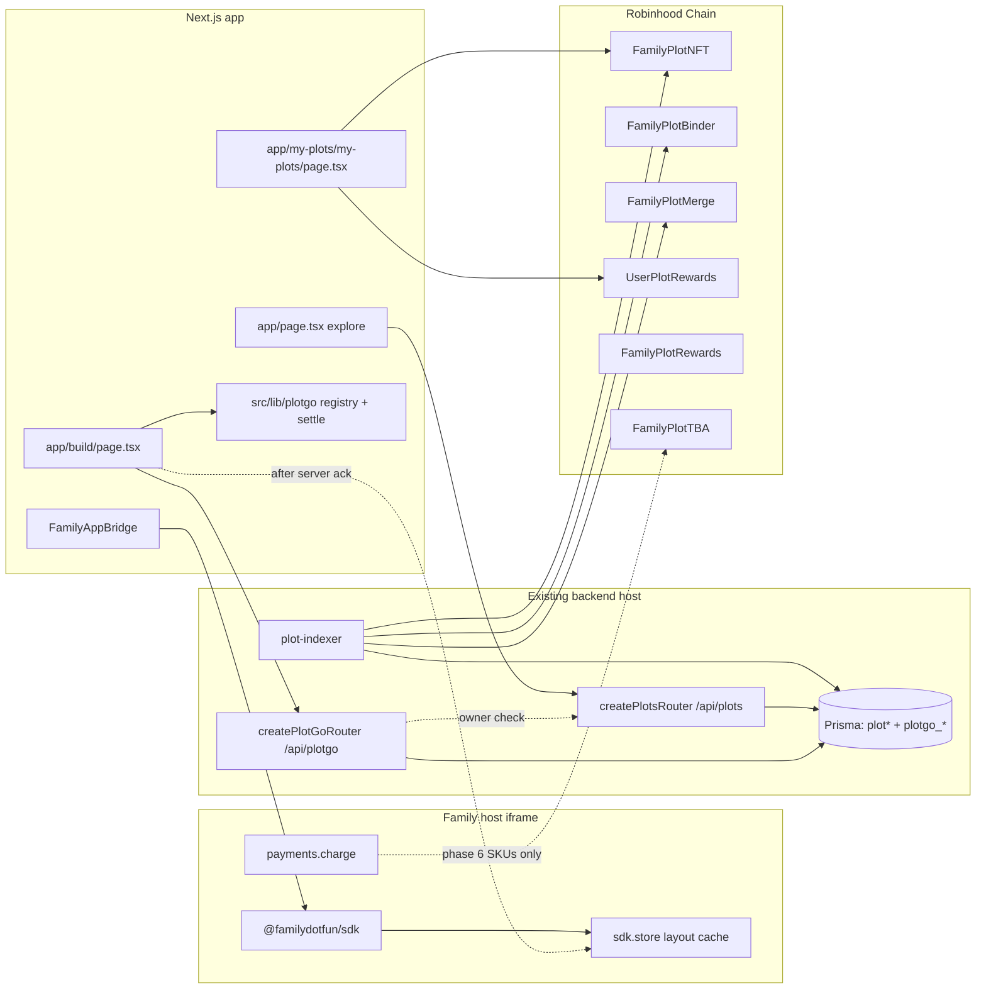
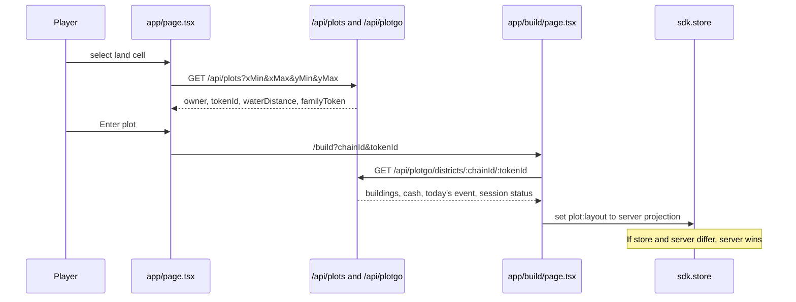
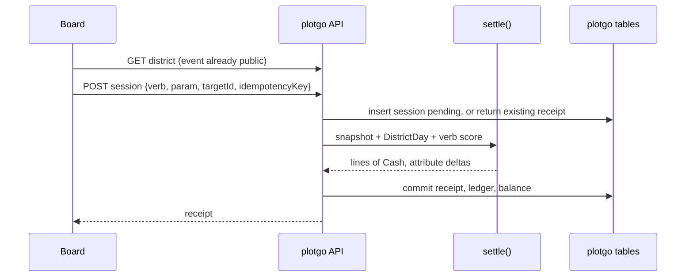

# PlotGo

| | |
|---|---|
| **Author** | _placeholder_ |
| **Date** | 2026-09-22 |
| **Status** | Draft |
| **Product** | PlotGo (Family app id remains `familydotfun.plot`) |
| **Repo** | `/Users/crayandre/Desktop/Development/Plot` |

## Overview

PlotGo joins two layers that already exist and must both survive. Outside, Family City is an explore map (`app/page.tsx`): vtraced art at `/map_vtraced.svg`, 6px cells, a 234×234 grid, districts North / East / Central / West / South. Land is an ERC-721 with an ERC-6551 token-bound account (`contracts/FamilyPlotNFT.sol`, `contracts/FamilyPlotTBA.sol`). Binding a plot to a family token is what puts an emblem on the map (`contracts/FamilyPlotBinder.sol`). Merges and splits scale that land (`contracts/FamilyPlotMerge.sol`). Owner income for holding land is `contracts/UserPlotRewards.sol`; family-bound capacity is `contracts/FamilyPlotRewards.sol`. None of that is a game loop.

Inside, `app/build/page.tsx` is a 12×12 finance builder still running as a local prototype: four hardcoded buildings, parcel name "Treasury District", parcel `#1184`, placement kept in React state, and a mirror of that list written to the Family SDK key `plot:district` by `src/components/FamilyAppBridge.tsx`. There is no economy. The yield readout is `buildings.length * 2.4 + 2.4`, which is a label, not a ledger.

PlotGo makes the 12×12 the **interior of one owned city plot**. The player acquires land on the map, opens that plot, and builds businesses on the board. The plot does not produce money. Businesses produce **Cash** because they take part in a simulated financial economy. **Cash** is the game economy. **$PLOT** is the redeemable on-chain asset, taken from a fixed weekly pool by burning eligible Cash. There is no standing rate such as 1,000 Cash = 1 `$PLOT`. `UserPlotRewards` is not retargeted into a building drip.

Authoritative Cash, levels, sessions, and events live in a server ledger mounted beside the existing plot indexer. The Family SDK store may cache a layout for the host. It is not the economy.

## Background & Motivation

### What is shipped today

**City (outside).** `app/page.tsx` loads `MAP_SRC = "/map_vtraced.svg"`, `MAP_SIZE = 1408`, `CELL = 6`, `GRID = 234`. `districtForCell` bands the grid into north / south / west / east / central, and the labels come from `DISTRICTS` in `app/city/city-map-model.ts` (West Yard, North Reach, East Commons, Civic Core, South Harbor). Water pixels are not selectable (`isWaterPixel`). The selection sheet's Claim button has no handler. `premium` is hardcoded `false` in `flyToCell` and in the land-click path, so the gold "Premium" chip never lights up. Premium on-chain is different and real: `FamilyPlotNFT._priceOf` adds `waterPremiumBps` when `waterDistance` is in `1..waterPremiumRadius`. `scripts/deployFamilyPlot.ts` seeds an example phase at 0.1 ETH, 50% premium, radius 2. `app/city/city-map-model.ts` also has circular `PREMIUM_CIRCLES`, but that module is not what `/` renders. The live map must not be deleted or replaced with the board.

**Ownership and indexing.** `IFamilyPlot.MergeSize` is Plot, Estate 2×2, Great House 4×4, District 8×8, Province 16×16, Domain 32×32, Realm 64×64. `FamilyPlotMerge._dimensionsOf` matches those widths. `capacityOf` on the NFT returns `width * height` for a merge and `1` for a single plot. Merge has a 7-day grace period (`GRACE_PERIOD_SECONDS`) before child NFTs burn. The binder is head-only and syncs family reward capacity. Contract addresses in `src/lib/chains.ts` (`DEPLOYED_PLOT_NFT`, `DEPLOYED_PLOT_BINDER`, `DEPLOYED_PLOT_MERGE`, `DEPLOYED_PLOT_FAMILY_REWARDS`, `DEPLOYED_PLOT_USER_REWARDS`) are empty pending `scripts/deployFamilyPlot.ts`. `app/my-plots/my-plots/page.tsx` already activates capacity and claims ETH via `encodeUpdateUserCapacity` / `encodeClaimUserRewards`. It links each card to `/city?plot=x,y`, but `app/city/page.tsx` is `redirect("/")` and does not forward the query. `SIZE_LABELS` stops at Domain; Realm (`MergeSize` 6) renders as `Tier 6`.

The indexer is `backend/services/plot-indexer.ts` (`syncPlotsForChain`, `syncAllPlotChains`). It upserts Prisma models `plot`, `plotTerritory`, `plotCoordinate`, and `indexCursor`. `backend/routes/plots.ts` exposes `createPlotsRouter`: list, territories, Merkle coordinate, `/:chainId/:tokenId`, and `/family/:slug`. `src/lib/plot-api.ts` is the matching client (`/api/plots`, API origin from `src/lib/api-base.ts`, server fallback `http://localhost:4000`). Two gaps are factual, not proposed: `backend/package.json` runs `tsx watch src/index.ts`, and that entry file is **not in this checkout**; there is also **no `schema.prisma` in the repo**. The router and indexer are libraries waiting on a host process and a schema that already know these model names. PlotGo extends that host. It does not replace it and does not stand up a second database.

**Board (inside).** `app/build/page.tsx` inlines `SPECS` for Community Bank `[3,2]`, Exchange Desk `[2,2]`, Investment Fund `[3,3]`, Treasury Vault `[2,1]`. `fitsAt` is an AABB test against `GRID = 12`. Two buildings are pre-placed (bank at `(2,2)`, vault at `(8,8)`). Both a react-three fiber canvas and an HTML isometric board render the same state. `FamilyAppBridge` calls `createFamilySDK()`, `sdk.init("plot-0.1.0")`, `getContext`, and bails unless `isUserContext`. It reads and writes `sdk.store` key `plot:district`. Chrome header is hardcoded "Treasury District". `family.manifest.json` requests only `user:identity`, `store:read`, `store:write`; `entryUrl` is `https://your-plot-host.example/build`; family slug `familydotfun`; `shareBps` 1000; pricing free; `custody` non-custodial. The SDK in `node_modules/@familydotfun/sdk` (npm `^0.1.0`) also defines `payments.charge`, `contract.invoke`, and `user:balance`, which the manifest does not request. `payments.charge` is a host-mediated on-chain transfer with an idempotency key and a split (platform 10% of gross, then family/developer on the remainder). That path is for $PLOT-or-quote SKUs later, never for game Cash.

### Pain

- The map and the board do not know about each other. Owning a plot does not open a district. `#1184` is a constant.
- Building identity, footprint, and "fee" are a closed array. A 30–50 type catalog cannot be added without rewriting the page.
- Footprints are accidental (`3×2`, `2×1`). Land inside the plot is not scarce in a way the player can reason about, and the UI caps the count at 12 buildings regardless of tiles.
- Any Cash figure stored in `sdk.store` can be minted by the client. `store.set` is called on every `buildings` change with the full list.
- A ticking balance would be a farm. The session needs a verb and an event.
- A fixed Cash-to-`$PLOT` rate would turn the district into an emission machine. Buildings must not mint the token on a timer. A capped weekly pool, claimed by burning eligible Cash, is the distribution. Land-reward contracts stay owner income for holding the plot.

## Goals & Non-Goals

### Goals

- Keep the city map, plot contracts, indexer, public map assets, and my-plots reward flows.
- Opening an owned plot enters its 12×12. Merged land eventually links or relates those boards; it does not become a second product.
- Replace hardcoded `SPECS` with a data-driven Building Registry that can grow to 30–50 types.
- Make footprints and adjacency the layout game. Square footprints: 1×1, 2×2, 3×3, 4×4. 144 tiles. One 4×4 competes with several smaller buildings.
- Every building answers: what it does, what makes it earn, what can make it earn more.
- Three income engines, all specified: district simulation (the floor), tokenized-stock portfolios (phased, in-game first), player-to-player fees (a bonus, not a requirement).
- Cash is the operating currency: build, upgrade, staff, research, repairs, licenses, assets, events, and upkeep. $PLOT comes only from a fixed weekly epoch pool. Claiming it burns eligible Cash. The player chooses between keeping Cash and taking $PLOT.
- A session is one chosen business verb plus one district event. Settlement is a pure function of a server seed so a replay matches the ledger.
- Server authority for economy. Client and `sdk.store` for presentation and a layout cache.
- The full catalog, engines, events, attributes, visuals, social layer, and on-chain join are phased below. Later phases are specified.

### Non-goals

- Deleting or rewriting `app/page.tsx`, `contracts/*`, `backend/services/plot-indexer.ts`, or `public/map_vtraced.svg`.
- Preserving the prototype's two hardcoded buildings or any `plot:district` JSON as economy state.
- Minting $PLOT, ETH, or any chain asset from building ticks, events, or daily sessions. The only $PLOT distribution is the fixed weekly epoch pool in Phase 6. A claim burns Cash. It does not mint Cash, and it does not pay $PLOT at a fixed rate.
- Changing `UserPlotRewards` or `FamilyPlotRewards` into a building drip. Their accounting (reward-per-share, `updateCapacity`, `claim`) stays.
- Custodial keys, `treasury:spend*`, or `trading:agent`. Manifest `custody` stays `non-custodial`.
- Live market data, real securities, or a compliance program in phases 0–6. Phase 7 is an adapter behind the same portfolio interface, gated by a product decision.
- A new city grid, a new merge size, or a 12×12 that grows to Realm scale (64×64 city plots is 4,096 boards of interior, not one giant board).
- Inventing traffic. This is an early Family app. Numbers below are per-plot capacity and a 100-session/day planning assumption.

## Key Decisions

1. **Interior of a parcel, not a replacement map.** The 234×234 city stays the acquisition layer. The 12×12 stays the operating layer. Rationale: both layers already exist; a previous removal of the map was reverted; land scarcity on-chain and layout scarcity inside the plot are different games.
2. **Activity economy, not timer emissions.** Cash is the output of a pure settlement function over district activity, building state, a public daily event, and one player verb. No `setInterval` mint. Rationale: a ticking dashboard is explicitly not the game, and it is the shortest path back to $PLOT-shaped sell pressure if anyone later wires the number on-chain.
3. **Server ledger beside the plot API, not `sdk.store` and not a new service.** New router `createPlotGoRouter` next to `createPlotsRouter`, same Prisma client, new tables. The chain indexer remains the ownership mirror. Rationale: `plot`, `plotTerritory`, and `/api/plots/family/:slug` are already the read model for "which land is this?"; Cash must not be client-writable; a second deployable is not justified at this DAU.
4. **Cash stays off-chain. $PLOT is claimed by burning eligible Cash against a fixed weekly pool.** Buildings never mint $PLOT. Protocol-fee ETH stays in the reward contracts. Rationale: a fixed Cash-to-token rate scales emissions with whatever the sim prints. A pool does not. Burning Cash is the decision between compounding the district and taking the token. See "Epoch payouts and Payout Day".
5. **One 12×12 per city plot; a merge unlocks a campus of boards, not a larger grid.** Cross-board adjacency only where child plots share an edge on the city grid. Rationale: Estate is 4 plots and Realm is 4,096. Scaling the interior with `MergeSize` destroys the 144-tile choice. Default for Open Question 1.
6. **The session verb is a chosen business action, once per plot per UTC day, taken after the day's event is visible.** Not a dice move. Rationale: the verbs that matter are price a loan, open the floor, rebalance, underwrite. The event is the board state those verbs answer. Default for Open Question 3.
7. **Registry data, not page special cases.** Footprints, earn inputs, adjacency, unlocks, tiers, and risk are rows. `fitsAt` becomes a pure function of a footprint and an occupant list. Rationale: `SPECS` and the inline overlap test cannot carry 16 types, let alone 50.
8. **The first buildings are sidewalk businesses, not institutions.** Phase 1 is the ATM, service kiosk, market terminal, money booth, curb desk, and lockbox. All are 1×1 or 1×2. A bank, an exchange, a fund, and a vault are later unlocks. The empty parcel should look humble. The first branch is something the player earns.
9. **Three art tiers mapped onto level bands.** Branch 1–4, regional 5–9, tower 10–20. The prototype's `floors` field is visual only and is not migrated. Rationale: per-level meshes do not pay for themselves at 20 buildings × 20 levels.
10. **Keep the Family app id.** Manifest `id` stays `familydotfun.plot`. Display name becomes PlotGo. `sdk.init("plot-0.1.0")` stays until a real protocol bump. Rationale: the id is the install key; renaming it orphans grants.
11. **District activity uses indexed `waterDistance`, not the explore page's `premium` boolean.** Near water (`1..2`, matching the example phase radius) is +20% simulated foot traffic. The map chip is a separate UI bug.
12. **Prototype districts are discarded.** First server create starts from an empty board at level 0 Cash. No import of the 3×2 bank into a 2×2 bank.
13. **Claim burns Cash.** On Payout Day the player chooses how much eligible Cash to destroy. Weight in that week's pool is the Cash they burned, capped by the eligible balance the score produced. Cash they do not burn stays spendable. Rationale: the player has to choose between a stronger district and `$PLOT`. Unburned Cash is not a silent claim on the token.
14. **NPCs are the customers. Employees are staff. Other players are premium activity.** The player does not hire customers. A plot has a simulated population, businesses attract the slice they are built for, and capacity stops growth until the player upgrades or opens another branch. Staff are departments, not a list of people. Real players sit on top of the NPC floor and count more toward the weekly score. See "Customers, staff, and the district population".

## Proposed Design

### Architecture



Authority split:

| State | Where it lives | Who may write it |
|---|---|---|
| City coordinates, water distance, owner, family bind, merge tree, TBA address | Chain, mirrored by `plot` / `plotTerritory` via `syncPlotsForChain` | The contracts. Indexer is a replica. |
| Protocol-fee ETH for holding land | `UserPlotRewards`, `FamilyPlotRewards` | Owner `claim` / family head `claim`. Unchanged. |
| Building specs, adjacency rules, event table, listed-asset definitions | Code in `src/lib/plotgo/` (shared with the API by extracting a package, or duplicated only if the backend cannot import from `src/` — see API section) | Deploys, not players. |
| Placed buildings, levels, Cash balance, sessions, district-day seed, portfolios, visit fees | `plotgo_*` tables | PlotGo API, after auth. |
| Layout cache for the Family chrome | `sdk.store` key `plot:layout` | Client, **after** a 2xx from the API. Server never reads it for settlement. |
| Eligible score, eligible Cash, epoch burns | `plotgo_epoch`, `plotgo_epoch_claim` | PlotGo API. The player chooses the burn. The server computes the share. |
| $PLOT epoch pool and scarce-SKU spends | Epoch distributor or merkle claim; otherwise `payments.charge` / a wallet `writeContract` | The user signs. The app does not hold keys. The pool size is an admin parameter, not a function of Cash minted. |

Standalone mode (the bridge already no-ops when `window.parent === window`) authenticates with a wallet signature against the same ledger. Iframe mode authenticates with the Family launch JWT from `sdk.init` (`iss: familydotfun`, `aud: family-app`, `appId`, `wallet`, `scopes`, ~15 minute `exp`). The API checks the platform key on every call. The JWT's `wallet` must equal the plot owner for mutations. A family member who is not the owner gets a read-only board in phase 6, not a writer.

### Opening a plot



`/build` without a token id is allowed only when `PLOTGO_REQUIRE_OWNERSHIP` is off (local and preview). The header stops saying "Treasury District" / `#1184`. Title is `{district label} · #{tokenId}` from indexed `district` (`0..4` via the labels already in my-plots) plus an optional server-side nickname. The explore sheet gains Enter plot when `owner` matches the connected wallet; the dead Claim button starts a mint only if `getPlotNftAddress` is non-empty, otherwise it explains that plot contracts are not configured (the same empty state my-plots already has). My-plots cards gain Build → `/build?chainId=&tokenId=` and the Map link changes from `/city?plot=` to `/?x=&y=` so the redirect cannot drop the target. `/` does not read `?plot=` today; phase 0 adds `x` and `y` search params to `flyToCell`.

### Building Registry

New module `src/lib/plotgo/types.ts` and `src/lib/plotgo/registry.ts`. The page imports specs. It does not declare them.

```ts
/** Minor units. 100 minor = 1 Cash. Never a float. */
export type CashMinor = number;

export type DistrictId = "north" | "east" | "central" | "west" | "south";

export type AdjacencyTag =
  | "banking"
  | "trading"
  | "brokerage"
  | "portfolio"
  | "treasury"
  | "research"
  | "insurance"
  | "liquidity"
  | "data"
  | "fintech"
  | "property"
  | "deals"
  | "stocks";

export type EarnEngine =
  | "spread"          // deposits × margin
  | "fee_volume"      // notional × fee
  | "commission"      // listed-asset notional × commission
  | "aum_fee"         // AUM × management fee, daily
  | "yield"           // staked capital × strategy yield
  | "premium"         // covered exposure × premium rate
  | "subscription"    // subscriber count × price
  | "deal"            // event deal notional × fee, zero on non-deal days
  | "boost_only";     // no direct Cash; multipliers only (Research, some Treasury effects)

export type EarnInput =
  | "customers"
  | "depositNotional"
  | "volumeNotional"
  | "listedNotional"
  | "aum"
  | "stakedCapital"
  | "coveredExposure"
  | "subscribers"
  | "dealNotional";

export type UpgradeLever =
  | "level"
  | "capacity"
  | "employees"
  | "research"
  | "condition"
  | "allocation";

export type UnlockRule =
  | { kind: "starter" }
  | { kind: "phase"; minPhase: number }
  | { kind: "reputation"; minBps: number }
  | { kind: "building"; typeId: string; minLevel: number }
  | { kind: "archetype"; archetype: EmpireId }
  | { kind: "and"; all: UnlockRule[] };

export type EmpireId = "trading" | "investment" | "banking" | "tokenized_stock";

export type VisualTier = "branch" | "regional" | "tower";

export interface BuildingSpec {
  id: string;
  name: string;
  code: string;
  /** What it does, one sentence. */
  function: string;
  /** What makes it earn, one sentence. */
  earnSummary: string;
  /** What can make it earn more. Shown on the card as levers, even if the spend is phase-gated. */
  upgradeLevers: UpgradeLever[];
  /** Width, height at rotation 0. Rotation 90 swaps them. */
  footprint: readonly [number, number];
  earn: {
    engine: EarnEngine;
    inputs: readonly EarnInput[];
    /** Margin, fee, commission, management fee, yield, or premium rate. */
    baseRateBps: number;
    /** Added to the rate for each level above 1. */
    levelRateBps: number;
    /** Capture weight at level 1. Siblings with the same engine split the district pool by weight. */
    capacityBase: number;
    capacityPerLevel: number;
  };
  adjacencyTags: readonly AdjacencyTag[];
  unlock: UnlockRule;
  tiers: readonly { tier: VisualTier; minLevel: number; maxLevel: number }[];
  risk: "low" | "medium" | "high" | "speculative";
  buildCostMinor: CashMinor;
  /** Per level above 1. Phase 1 charges 0 upkeep; the field exists so phase 2 does not redesign the spec. */
  upkeepMinorPerLevel: CashMinor;
  /** Box tint until a mesh exists. Bank keeps #b7ff4a, exchange #62d8ff, fund #d79cff, vault #ffd166. */
  color: string;
  maxLevel: number; // 20 for every row in v1 of the catalog
}

export interface AdjacencyRule {
  id: string;
  a: AdjacencyTag;
  b: AdjacencyTag;
  contact: "edge"; // corners do not count
  target: "a" | "b" | "both";
  stat:
    | "volume"
    | "margin"
    | "aum"
    | "defaultRisk"       // negative bonusBps lowers risk
    | "capitalEfficiency"
    | "productRevenue"
    | "tradingActivity";
  bonusBps: number;
  /** Applied instead of bonusBps for the second distinct pair of the same rule. A third pair adds 0. */
  diminishBps: number;
  minPhase: number;
}

export interface BuildingInstance {
  id: string;
  typeId: string;
  x: number;
  z: number;
  rotation: 0 | 90;
  level: number;          // 1..maxLevel
  conditionBps: number;   // 10_000 = sound. Phase 2.
  employees: number;      // Phase 2 service bar, 0–10. Complex buildings use departments instead of hiring individuals.
  departments: { id: string; filled: number; cap: number }[]; // phase 2 on bank, exchange, fund
  feePostureBps: number;  // 5000–15000 around the spec rate. Standing decision, not the daily verb.
  satisfactionBps: number;
  researchBps: number;    // Phase 2. Extra rate, not a second level.
  /** Cash the player has allocated into this building. Phase 4 portfolios read this. */
  allocatedMinor: CashMinor;
}
```

Adding a type is a new `BuildingSpec` plus, if needed, one `AdjacencyRule`. No page branch. The registry exports `specById`, `unlockedSpecs(progress)`, and `tierForLevel`. Unknown `typeId` from the client is a 400, not a fallback to "bank".

### Catalog

Rates are the phase-1 tuning baseline (integer bps). They are data. A later balance PR may change numbers without changing the schema. "Capture" is the building's weight when buildings of the same engine split that day's district pool. Direct Cash is zero for `boost_only`.

| id | Name | Footprint | Phase | Engine | Base rate | Tags | What it does → what earns → what earns more |
|---|---|---|---|---|---|---|---|
| `atm` | ATM | 1×1 | 1 | fee_volume | 40 bps of a small withdrawal | sidewalk | A machine on the pavement. Earns a fee on captured withdrawals. Level, and the kiosk beside it. It does not take deposits and it does not lend. |
| `kiosk` | Service Kiosk | 1×1 | 1 | fee_volume | 80 bps retail | sidewalk | Bill pay and small remittances. Earns a retail fee. Level, and the ATM beside it. |
| `terminal` | Market Terminal | 1×1 | 1 | commission | 60 bps | sidewalk | One screen of prices. Earns a commission on a handful of look-ups and tiny orders. Level, and the curb desk beside it. |
| `booth` | Money Booth | 1×2 | 1 | spread | 80 bps on a small retail spread | sidewalk | A folding counter that changes cash. Earns the spread. It is not an exchange. Level, and the lockbox beside it. |
| `curb` | Curb Desk | 1×2 | 1 | commission | 40 bps | sidewalk | A table that writes a few retail tickets. Earns a commission. It is not a brokerage. Level, and the terminal beside it. |
| `lockbox` | Lockbox | 1×1 | 1 | yield | 20 bps / year on cash left in the box | sidewalk | A box. Holds a little float. Almost no yield. It is not a vault and it runs no strategy. The booth beside it is what makes it useful. |
| `bank` | Community Bank | 2×2 | 2 | spread | 240 bps margin | banking | The first real institution. Unlocks when any sidewalk building on the plot reaches L3. Takes deposits and prices loans. Earns the interest spread. Level, loan verb, Insurance adjacency, lower default risk. |
| `insurance` | Insurance Office | 2×2 | 2 | premium | 120 bps of covered exposure | insurance, banking | Unlocks with the bank. Insures the deposits the branch actually holds. Earns premiums; pays claims when crash or bank-run events fire. |
| `research` | Research Center | 2×2 | 3 | boost_only | — | research | Publishes a daily view. No direct Cash. Adds rate bps to portfolio and trading neighbors. Staff and research spend. |
| `fintech` | Fintech Hub | 2×2 | 3 | subscription | 500 minor per subscriber-weight | fintech, data | Ships a financial product. Earns product revenue. Data Center adjacency. |
| `exchange` | Exchange Desk | 3×3 | 3 | fee_volume | 30 bps | trading | A venue. Not available on an empty plot. Unlocks when the bank is L3. Earns fee × captured volume. Level, open-the-floor verb, Market Maker adjacency. |
| `brokerage` | Brokerage | 2×2 | 3 | commission | 40 bps | brokerage, stocks | A house, not a curb desk. Unlocks with the exchange. Earns commission on listed notional. Rebalance verb, Stock Exchange adjacency, portfolio weights in phase 4. |
| `fund` | Investment Fund | 3×3 | 3 | aum_fee | 150 bps / year, charged daily | portfolio | Unlocks when the brokerage is placed. Manages a book. Earns AUM × fee / 365. Research adjacency, rebalance verb. |
| `vault` | Treasury Vault | 2×2 | 3 | yield | 80 bps / year on staked capital, daily | treasury, banking | Unlocks when the bank is L5. Holds reserves and runs a simple strategy. Earns yield on capital allocated into it. Underwrite verb, Treasury adjacency. |
| `treasury` | District Treasury | 2×2 | 3 | yield | 40 bps / year on district float | treasury | Unlocks with the vault. Holds district working capital. Raises capital efficiency of treasury-tagged neighbors. |
| `data_center` | Data Center | 2×2 | 3 | subscription | 800 minor per subscriber-weight | data | Sells data feeds to the district. Subscription income. Fintech adjacency raises product revenue on both. |
| `market_maker` | Market Maker | 2×2 | 3 | fee_volume | spread 12 bps of touched volume | liquidity, trading | Quotes both sides. Earns spread. Exchange adjacency raises volume for both. Loses money on a crash if risk is high (phase 3 settlement subtracts inventory loss). |
| `trading_floor` | Trading Floor | 3×3 | 3 | fee_volume | 45 bps | trading | Active floor. Volume plus a larger cut of market-event income than the desk. High risk. |
| `asset_manager` | Asset Manager | 2×2 | 3 | aum_fee | 80 bps / year | portfolio | A second AUM business, smaller than the fund, that can run a different book. |
| `reit` | REIT Tower | 3×3 | 3 | aum_fee | 200 bps / year labeled as rent | property, portfolio | Holds a property book. "Rent" is AUM yield inside the sim, not city-plot rent and not `UserPlotRewards`. |
| `stock_exchange` | Stock Exchange | 4×4 | 3 | fee_volume | 18 bps on a larger listing pool | stocks, trading | The hub. Lower fee rate, much higher capacity, only pays the listing pool (see engine 2). 16 tiles. |
| `investment_bank` | Investment Bank | 4×4 | 3 | deal | 300 bps of `dealNotional` | deals, banking | Earns on IPO Boom and Earnings Season deal flow, almost nothing on a quiet day. 16 tiles. The reason not to fill the board with kiosks. Attracts corporations, not households. |
| `restaurant` | Restaurant | 1×1 | 3 | boost_only | — | environment | Foot traffic. Lifts the household pool. No direct Cash. |
| `hotel` | Hotel | 2×2 | 3 | boost_only | — | environment | Visitors. Lifts households and traders. |
| `apartments` | Luxury Apartments | 2×2 | 3 | boost_only | — | environment | Wealthier residents. Moves households into the investor segment. |
| `office` | Office Tower | 2×2 | 3 | boost_only | — | environment | Companies. Lifts business clients. |
| `university` | University | 2×2 | 3 | boost_only | — | environment | Skilled workers. Lifts retail investors. |
| `tech_campus` | Technology Campus | 2×2 | 3 | boost_only | — | environment | High-income professionals. Lifts investors and traders. |
| `convention` | Convention Center | 3×3 | 3 | boost_only | — | environment | Traffic spike on IPO Boom and Bull Market. |

Phase-1 adjacency (all `contact: "edge"`, `diminishBps` = half of `bonusBps`, third pair 0). These are sidewalk pairs. They do not mention a bank or an exchange.

| Rule | Pair | Stat | Bonus |
|---|---|---|---|
| `atm_kiosk` | ATM ↔ service kiosk | retail fee +8% on both | 800 |
| `terminal_curb` | market terminal ↔ curb desk | ticket count +10% on both | 1000 |
| `booth_lockbox` | money booth ↔ lockbox | spread +8% on the booth; the box is slightly safer | 800 |

Rules present in data but inert until their buildings can be placed:

| Rule | Pair | Stat | Phase |
|---|---|---|---|
| `bank_insurance` | banking ↔ insurance | `defaultRisk` −20% on the bank; insurer loss ratio improves by the same | 2 |
| `vault_treasury` | vault ↔ district treasury | `capitalEfficiency` +15% on both | 3 |
| `exchange_brokerage` | exchange ↔ brokerage | `tradingActivity` +12% on both | 3 |
| `bank_fund` | bank ↔ fund | `margin` +8% on the bank, `aum` +8% on the fund | 3 |
| `fund_research` | fund ↔ research | `aum` +15% on the fund; research stays boost-only | 3 |
| `exchange_mm` | exchange ↔ market maker | `volume` +15% on both | 3 |
| `brokerage_stocks` | brokerage ↔ stock exchange | `tradingActivity` +15% | 3 |
| `fintech_data` | fintech ↔ data | `productRevenue` +15% on both | 3 |

`capitalEfficiency` multiplies yield engines. `tradingActivity` multiplies `volumeNotional` and `listedNotional` for that building only. `productRevenue` multiplies subscription engines. `defaultRisk` is stored and, from phase 2, scales claim losses. It does not change phase-1 Cash.

**Tile budget, one board.** 144 tiles. Instance cap 24 (replaces the cosmetic `buildings.length / 12`). A developed board is expected to occupy 40–80 tiles and 6–12 buildings, not 144.

| Layout | Tiles | Buildings | What you gave up |
|---|---|---|---|
| One Investment Bank + one Stock Exchange | 32 | 2 | Almost all small-business capture. Huge on IPO days, quiet otherwise. |
| Phase-1 sidewalk: ATM, kiosk, terminal, booth, curb desk, lockbox | 1+1+1+2+2+1 = 8 | 6 | No branch, no venue, no fund. Eight tiles on a 144-tile parcel. The board still looks empty. |
| The first bank, once unlocked, plus the sidewalk | 8+4 = 12 | 7 | The first time the plot takes deposits. Still no exchange. |
| Four 2×2 banks and no venue | 16 | 4 | Deposit pool is split four ways; no trading volume is captured. Only possible after the bank unlocks. |
| Twenty-four 1×1 kiosks (the cap) | 24 | 24 | Retail fees on a small pool. Loses to a single exchange on any normal day, once an exchange can be built. |

That last row is why the cap is an anti-spam limit and the footprint is the real constraint. Two 4×4 towers plus the six starters is 66 tiles. The player cannot also drop a trading floor, a REIT, and a data center without demolishing something. Demolish returns 50% of `buildCostMinor` to Cash and deletes the instance. Demolish is in phase 1 so a bad footprint is not permanent.

### Placement

`fitsAt` moves from `app/build/page.tsx` (lines 48–55) to `src/lib/plotgo/placement.ts`. Behavior stays: origin tile, rotation swaps width and height, reject out of `[0, 12)`, reject AABB overlap. The signature stops taking a `BuildingType` and stops closing over `SPECS`.

```ts
export type Occupant = { x: number; z: number; w: number; h: number };

export function footprintOf(spec: BuildingSpec, rotation: 0 | 90): { w: number; h: number } {
  const [w, h] = spec.footprint;
  return rotation === 90 ? { w: h, h: w } : { w, h };
}

export function fitsAt(origin: { x: number; z: number }, size: { w: number; h: number }, occupants: Occupant[], grid = 12): boolean {
  const { x, z } = origin;
  if (x < 0 || z < 0 || x + size.w > grid || z + size.h > grid) return false;
  return !occupants.some((o) => x < o.x + o.w && x + size.w > o.x && z < o.z + o.h && z + size.h > o.z);
}
```

The client uses this for the ghost (green / `BLOCKED`, same as today). The server runs the same function. The client does not send `w`/`h`. It sends `{ typeId, x, z, rotation }`. The server loads the spec, checks unlock, checks Cash ≥ `buildCostMinor`, checks the instance cap, then `fitsAt`. Preview rotation in the page stays `0 | 90` only, matching `FamilyPlotBuilding.rotation`.

`worldCenter` and both renderers (canvas boxes and the isometric `grid-cols-12`) stay in the page but read `spec.footprint`, `spec.color`, `spec.code`, and `tierForLevel` instead of `SPECS`.

### Economic engines

All three engines are inputs to the same `settle` function. Phase 1 implements engine 1 only. Engines 2 and 3 add inputs; they do not add a second balance.

**Shared district day.** One row per city district per UTC date, not per plot. Every plot in Civic Core shares customers, the event, and listed-asset returns. Plots still settle separately because capture depends on what they built. Water bonus is per plot, from that plot's indexed `waterDistance`, applied as a multiplier on the customers that plot is allowed to see (a waterfront plot is busier; an inland plot in the same district is not).

Planning bases, before noise, water, and reputation:

| City district | Base customers / day | Why |
|---|---|---|
| north (North Reach) | 90 | New builds, slightly thin |
| east (East Commons) | 100 | |
| central (Civic Core) | 140 | Densest |
| west (West Yard) | 80 | |
| south (South Harbor) | 120 | Markets and waterfront, per the district blurb |

Noise is ±15% from the day seed (`8500..11500` bps). Near water (`waterDistance` 1 or 2) is ×1.20, matching the on-chain premium radius in the deploy script. Reputation is ×1.00 until phase 2, then `reputationBps / 10_000` clamped to `0.80..1.30`.

Per customer of district flow, before capture:

- Deposit notional: 2,000 minor (20 Cash).
- Volume notional: 5,000 minor (50 Cash).
- Listed notional: 0 in phase 1 wiring, then 40% of volume once brokerage/stock buildings exist (phase 1 still **stubs** listed notional at 40% so brokerage is not a dead building — the stub is a constant, not a price).
- External AUM added to funds: 20,000 minor (200 Cash) per captured customer, marked daily.
- Subscriber weight: 1 per 10 customers, split across subscription buildings.
- Deal notional: 0 except on deal events (below).

Capture: buildings that list a given input split that pool by `capacity(level) = capacityBase + (level-1) * capacityPerLevel`, each capped at `capacity` customers so a level-1 ATM cannot swallow Civic Core. Uncaptured flow is wasted. That is intentional. An empty plot earns 0. A sidewalk plot earns fees and spreads. It earns no deposit spread until a bank is unlocked, and no venue fees until an exchange is unlocked.

**Worked phase-1 day, stated so tuning can be checked.** Civic Core, inland, noise 1.00, reputation 1.00 → 140 passers-by. The sidewalk can only catch a few of them. One level-1 ATM, capacity 40, withdrawal notional 2,000 minor, fee 40 bps → 40 × 2,000 × 0.004 = **320 minor (3.20 Cash)**. One service kiosk, capacity 30, ticket 1,000 minor, fee 80 bps → **240 minor (2.40 Cash)**. One curb desk, capacity 15, ticket 5,000 minor, commission 40 bps → **300 minor (3.00 Cash)**. A money booth and a lockbox on a fresh plot add a small spread and almost no yield. A full sidewalk of six, with one successful verb (×1.25 on one target), lands roughly **12–20 Cash**. That is a stall, not a branch. The bank's 38 Cash day from the old example is what the branch earns after it unlocks, and it is no longer the first receipt a player sees. Upgrade L1→L2 of a 1×1 costs 40 Cash, a few sessions, not a month.

| Action | Cost (minor) | Notes |
|---|---|---|
| Place 1×1 | 2,000 | 20 Cash. An ATM, a kiosk, a terminal, or a lockbox. |
| Place 1×2 | 4,000 | 40 Cash. A money booth or a curb desk. |
| Place 2×2 | 8,000 | 80 Cash. A bank, once it is unlocked. The opening grant cannot afford one. |
| Place 3×3 | 20,000 | 200 Cash |
| Place 4×4 | 60,000 | 600 Cash |
| Level up | `4,000 * level * footprintTiles` | L1→L2 of a 1×1 is 4,000 minor (40 Cash). L1→L2 of a 2×2 is 16,000 minor (160 Cash). |
| Starting Cash on first create | 250,000 | 2,500 Cash. The first five minutes can fund a Cash Kiosk, Trading Booth, and Savings Stand, with the first positive customer-driven Cash delta before the upkeep economy begins. |

These costs live in the spec (`buildCostMinor`) and a single `levelCost` function, not in the page. Phase 1 starting grant is the only Cash that appears from nothing, once per plot, server-side, idempotent on district create.

**Engine 2 — tokenized stocks (phase 4, interface reserved now).** A portfolio is a list of weights on in-game listed assets. v1 symbols are `NVDA`, `AAPL`, `TSLA`, and `CASH`, stored as game instruments with a display name that includes the word "in-game". They are not orders to a broker and not a claim on the real ticker. Each UTC day the district seed picks a return in bps per symbol from a bounded table (±500 bps, fat tail only on event days). Fund, brokerage, asset manager, and REIT may hold a portfolio. Settlement marks `allocatedMinor` by the weighted return **before** the fee is charged, and the fee uses end-of-day AUM. A building with no allocation still earns the external simulated AUM from engine 1, so phase 4 does not brick phase-1 saves.

Sector tags on symbols (`technology`, `consumer`, `financial`) do nothing to the map until phase 4's second step: a plot whose portfolio is ≥60% one sector gets that sector tag for adjacency and events (AI Mania boosts `technology`). Sector **districts** and ticker-specific campuses are not a new grid. They are a tag bonus when a bound family or a campus nickname matches a sector, specified in phase 4 and not built in phase 1. The portfolio interface is:

```ts
export interface ListedAsset {
  symbol: string;          // "NVDA"
  name: string;            // "In-game NVDA"
  sector: "technology" | "consumer" | "financial" | "cash";
  /** Phase 7 may replace the generator. Callers only see the day's close. */
  source: "sim" | "external";
}

export interface Position {
  symbol: string;
  weightBps: number;       // sum to 10_000
}

export interface DayMark {
  symbol: string;
  returnBps: number;       // applied to weight
}
```

**Engine 3 — player fees (phase 5).** Another player may visit a district and use one business: trade (exchange/brokerage/stock exchange fee), deposit to a fund (that day's management fee on the deposited notional, returned when they withdraw, no lock beyond the UTC day), or borrow (bank spread on a simulated loan that repays from the borrower's Cash the next time they settle). The visitor pays Cash from their own ledger. The host receives the fee. The district simulation does not shrink. Player flow is added on top of the floor, which is the Monopoly-rent analog: useful, never required for the loop to tick. Fee split on a visit is 100% to the host building's owner in Cash. It is not a `payments.charge` and not a protocol-fee. $PLOT is not involved. On the ledger this is `player_revenue`, weighted 1.5 in the epoch score. NPC business income stays `operating`.

### Customers, staff, and the district population

The player does not hire customers. Three different things feed a building:

| | Who | What the player does |
|---|---|---|
| NPCs | The simulated population | Attract and keep them |
| Employees | Staff departments the player funds | Raise service, capacity, and lower risk |
| Other players | Real visits, phase 5 | Become the higher-weighted revenue |

Phase 1 keeps the single shared customer count in `DistrictDay` (Civic Core's worked example of 140). That number is the stand-in. `plotgo.population` (phase 2) replaces it with per-plot segments, because a hotel on this board must not also fill every other plot in Civic Core. The event and the noise seed stay on the shared district-day row.

A new plot, once the flag is on, starts at:

| Pool | Count |
|---|---|
| Population | 2,500 |
| Potential banking customers (depositors and borrowers) | 900 |
| Potential investors (capital that can reach a fund) | 300 |
| Potential traders | 180 |
| Business clients (companies) | 40 |

Those are the opening pools, not a promise of active customers. Buildings compete for the segment they serve.

| Building | NPC segment |
|---|---|
| Bank | Depositors and borrowers |
| Insurance | Households and businesses |
| Brokerage | Retail investors |
| Fund, asset manager | Investors with capital |
| Exchange, trading floor, market maker | Traders, and institutions once reputation is high |
| Investment bank | Corporations |
| Wealth path (asset manager fed by the pipeline below) | Higher-net-worth NPCs |

A district of ordinary households fills a bank and an insurer and leaves an investment bank empty. A smaller, wealthier district can hold fewer people and more assets under management. Supporting buildings exist to change that mix. They are not a second set of printers.

Active customers for one building, computed on the server and not shown as a formula:

```text
active = min(capacity,
  segmentPool
  * demand(fee posture, event)
  * reputation
  * accessibility(adjacency, supporting buildings)
  * service(staff)
  * marketing(active campaign))
```

The card shows the result:

> **Plot Bank**
> Customers: 1,842 / 2,500
> New this week: +218
> Satisfaction: 84%
> Reputation: 72
> Customer growth: +9.4%

Phase 1's card stays level, capacity, and today's Cash. This card is phase 2.

**Capacity stops growth.** A bank's customer cap by level, once `plotgo.population` is on:

| Level | Customers |
|---|---|
| 1 | 500 |
| 2 | 1,200 |
| 3 | 3,000 |
| 4 | 7,500 |

Other types use the same shape scaled by footprint: a 1×1 is about a quarter of the bank curve, a 3×3 about the bank curve, a 4×4 about double. At capacity, wait time rises, satisfaction falls, and the growth term goes to 0. Uncaptured demand is wasted. The player upgrades or places another branch. Phase 1's `capacityBase` table still settles the day until this flag is on, so the 38.40 Cash worked example does not change under the phase-1 test.

**Population has a ceiling.** Supporting buildings add people and shift wealth. They cannot multiply the pool without limit. Each plot's population caps at 4× its opening population (10,000 on the starter). Segment pools cap at the shares above, plus the shift from environment buildings, and never exceed the population. Past the cap, another hotel does not create another customer.

**Environment buildings** are phase 3, `boost_only`, and mostly small. Direct Cash is 0. They change the pool.

| id | Name | Footprint | Effect |
|---|---|---|---|
| `restaurant` | Restaurant | 1×1 | Foot traffic. Small lift to household count. |
| `hotel` | Hotel | 2×2 | Visitors. Lifts traders and households for a few days after placement and again on a campaign. |
| `apartments` | Luxury Apartments | 2×2 | Wealthier residents. Moves households into the investor segment. |
| `office` | Office Tower | 2×2 | Companies. Lifts business clients. |
| `university` | University | 2×2 | Skilled workers. Lifts retail investors. |
| `tech_campus` | Technology Campus | 2×2 | High-income professionals. Lifts investors and traders. |
| `convention` | Convention Center | 3×3 | A periodic spike of financial traffic on event days (IPO Boom, Bull Market). The only environment building larger than 2×2. |

A board of hotels does not out-earn a bank. The finance building still has to exist to capture the segment. Environment tiles that push a theme under the 40% rule weaken that empire's bonus, which is intentional: the hotel is taking a finance tile.

**Staff are departments, not a payroll of people.** The player never hires 700 tellers. Simple buildings (ATM, kiosk, restaurant) have one service bar, 0–10, paid in Cash. Complex buildings expose departments:

> **Exchange — Level 5**
>
> Operations: 7/10
> Technology: 9/10
> Compliance: 5/10
> Research: 8/10

Bank departments are tellers, loan officers, and a manager, stored as the same three-slot shape under those labels. Fund departments are analysts and a portfolio manager. Research Center departments are analysts and economists. Filling a slot spends Cash, raises service, raises effective capacity a step, and lowers risk. Empty compliance on an exchange raises risk. Phase 2 ships the single service bar plus departments on the bank, the exchange, and the fund. Other department labels turn on with their buildings.

**Customers move between businesses.** This is the adjacency rule with a cause, and it replaces a flat "+10% activity" once `plotgo.population` is on. Each step converts a capped fraction of yesterday's active customers. The cap is 15% of the source building's active count, so a level-10 bank cannot mint a level-10 fund.

| Pair | Conversion |
|---|---|
| Bank → Brokerage | 8% of bank customers become retail investors |
| Bank + Insurance, edge adjacent | 12% of bank customers also buy insurance |
| Brokerage → Fund | Traders in the top satisfaction band can become fund investors |
| Fund → Asset manager | A further slice of fund investors become the higher-net-worth book |

The pipeline the player is building is **Bank → Brokerage → Fund → Wealth**. Insurance cross-sells beside the bank. A missing step wastes the conversion.

**Fees are a standing decision.** Each earning building has a fee posture in a band around its base rate (50% to 150% of the spec rate). Lower fees raise demand and cut Cash per customer. Higher fees do the opposite. Posture is saved on the building and can be changed without spending the day's verb. The server clamps the band. The client does not send the resulting customer count.

**Campaigns spend the day's verb.** They are how the player pushes acquisition. They last through that UTC settlement day, not a 12-hour realtime window, so missing an hour does not waste the spend. A second day of the same campaign is another verb and another cost.

| Campaign | Cash | Effect for that settlement day |
|---|---|---|
| Retail banking | 50,000 minor (500 Cash) | +15% depositor demand on the targeted bank |
| Investor roadshow | 80,000 minor | Shifts demand toward fund clients |
| Zero commission | 0, plus the day's commissions cut to 0 on the target | Brokerage or exchange volume up sharply, commission Cash for that day is 0 |
| IPO campaign | 120,000 minor | Business-client demand on the investment bank. Weak on a day whose event is not IPO Boom or Earnings Season |

A campaign is a parameter of the session verb `campaign`, with a target building. It does not hire NPCs. It changes demand for one settlement.

**Players on top.** NPC revenue is the floor and is `operating` Cash. A real player using the exchange, the fund, or the brokerage is `player_revenue`. The epoch score already weights that category at 1.5, with one contribution per counterparty wallet per epoch. The population cap and the per-plot eligible-Cash cap keep a stack of hotels from inflating the `$PLOT` pool.

### Events and the session

Nine events. One is drawn when the district-day row is created, weighted, from the seed. It is public before the player picks a verb. District multipliers stack on the event's primary stat only.

| Event | Weight | Primary effect | District tilt | Buildings that care |
|---|---|---|---|---|
| Bull Market | 14 | volume and listed notional ×1.25; AUM mark +150 bps | south ×1.10 | exchange, brokerage, fund, trading floor |
| Rate Cut | 12 | bank margin +80 bps; vault yield −20 bps annualized; fund external AUM ×1.15 | central ×1.10 | bank, fund, vault |
| Market Crash | 8 | volume ×1.40 (panic flow) but AUM mark −800 bps; insurer pays claims; MM inventory loss | south ×1.15 | fund, insurance, market maker, REIT |
| IPO Boom | 8 | `dealNotional` = 200,000 minor × investment-bank capacity factor; listed volume ×1.50 | north ×1.15 | investment bank, brokerage, stock exchange |
| Liquidity Crisis | 8 | volume ×0.70; MM spread ×2 if the building has liquidity tag; vault capital-efficiency matters (unreserved vaults take a haircut) | west ×1.10 | market maker, vault, treasury, exchange |
| AI Mania | 10 | technology-sector marks +600 bps; research adds an extra +5% to neighbors; fintech subscribers ×1.30 | east ×1.10 | research, fintech, any technology book (phase 4) |
| Bank Run | 6 | bank capture ×0.50; if bank risk is high, a Cash loss equal to 10% of yesterday's deposits; insurance pays 70% of that loss if adjacent | central ×1.20 | bank, insurance, vault |
| Dividend Day | 12 | portfolios and REIT pay 40 bps of AUM as Cash, not as a mark | none | fund, brokerage, REIT, asset manager |
| Earnings Season | 12 | research bonus doubles; rebalance verb ceiling rises; small deal notional (25% of IPO Boom) | east ×1.10 | research, fund, investment bank, brokerage |

Weights sum to 90; the remaining 10 is "Quiet Session": all multipliers 1.00, so a verb still matters and the player can learn the board.

**Resolution order, fixed:**

1. **Materialize `DistrictDay`** if `(cityDistrict, utcDate)` is absent: seed, event id, per-asset returns, base customer count. Unique constraint. Two plots opening at once cannot draw two events.
2. **Show the event.** The board refuses to settle with a hidden event.
3. **Accept one verb** for `(plotId, utcDate)`. Parameter is an enum, not a number the client computed.
4. **Score the verb** on the server from `hash(seed, plotId, verb, param, targetBuildingId)`. The building's level shifts the success band. Output is a multiplier in `{1.00, 1.15, 1.25, 1.40}` and, from phase 2, a risk delta. The client never sends the multiplier.
5. **Apply event mods** to the day's inputs (volume, margin, marks, deal notional, claim losses).
6. **Apply the verb multiplier** only to the targeted building.
7. **Apply adjacency** from the registry, with diminishing returns, using current coordinates.
8. **Run `settleBuilding`** in stable order `(typeId, instanceId)`.
9. **Subtract upkeep and losses** (0 upkeep in phase 1; crash claims from phase 2).
10. **Commit** balance, ledger lines, and the session receipt in one database transaction. A second POST with the same idempotency key returns the stored receipt and does not move Cash.



Verbs (phase 1 has all four; the UI only enables those the board can perform):

| Verb | Requires | Player choice | What "good" means |
|---|---|---|---|
| `price_loan` | a bank | conservative / standard / aggressive | Choice matches the day's hidden credit quality from the seed. |
| `open_floor` | an exchange, trading floor, or stock exchange | tight / standard / wide fees | Choice matches the day's volatility. |
| `rebalance` | a fund, brokerage, or asset manager | overweight cash / growth / value (phase 4: a real weight vector, still scored server-side) | Overweight matches the day's winning bucket. |
| `underwrite` | a vault or treasury | reserve ratio low / standard / high | Choice matches liquidity pressure. A Liquidity Crisis rewards high. |

If the player has no qualifying building, the only verb is `walk`, multiplier 0.85 on every building, still once per day. Active Activity Points and Hunts require a meaningful action, while the canonical Idle / Offline Economy processes signed Cash and customer changes for up to 12 hours at declining efficiency. Anti-farm: offline revenue and growth receive only partial Performance credit, and the economy freezes after the cap.

`settle` is pure:

```ts
export interface SettleInput {
  day: number;
  seed: number;
  district: DistrictId;
  waterDistance: number;
  reputationBps: number;
  buildings: readonly BuildingInstance[];
  specs: readonly BuildingSpec[];
  rules: readonly AdjacencyRule[];
  eventId: string;
  verb: { id: string; param: string; targetId: string; multiplierBps: number };
  marks: readonly { symbol: string; returnBps: number }[];
  /** Engine 3. Empty in phases 1–4. */
  visits: readonly { engine: EarnEngine; notionalMinor: number }[];
}

export interface SettleLine {
  instanceId: string;
  grossMinor: number;
  upkeepMinor: number;
  lossMinor: number;
  netMinor: number;
  inputs: Record<string, number>; // the numbers the UI shows, so the formula is not a black box
}

export function settle(input: SettleInput): { lines: SettleLine[]; netMinor: number };
```

Same input, same output, in the browser replay and on the server. The server is the only writer. The client may call `settle` to **preview** today's numbers before confirm; the preview must use the seed from the GET, and the POST recomputes rather than trusting the preview payload. Tests belong in `src/lib/plotgo/settle.test.ts`. `test/FamilyPlot.test.ts` stays the chain suite and is not the home for this.

### Attributes and visuals

Five attributes. Stored from phase 1 so later phases do not migrate the instance row. Shown when they start to change decisions.

| Attribute | Stored | Player-facing | Meaning |
|---|---|---|---|
| Level | phase 1 | phase 1 | Upgrade spend. Shifts rates, capacity, verb success band, and the art tier. |
| Capacity | derived from level + spec | phase 1 | Customers or weight this building can take today. |
| Revenue | the session line | phase 1, as today's Cash | Not a lifetime counter in the early UI. A 7-day sparkline arrives in phase 2. |
| Risk | phase 1, mutated from phase 2 | phase 2 | Events and the aggressive verb move it. High risk raises crash and bank-run losses. |
| Reputation | plot-level, phase 1 column, mutated from phase 2 | phase 2 | Visitors and tomorrow's customer multiplier. Not a building stat. |

Example card, phase 1: level, capacity, and today's Cash.

Example card, phase 2, once `plotgo.population` is on: **Plot Bank**. Customers 1,842 / 2,500. New this week +218. Satisfaction 84%. Reputation 72. Customer growth +9.4%. Risk on the same card when `plotgo.risk` is on. The acquisition formula stays on the server.

Art bands, every spec:

- L1–L4 branch. The current box mesh, height from the spec, modest emissive.
- L5–L9 regional. Taller box, stronger edge, code plate larger. Still one mesh family.
- L10–L20 tower. Tallest box, glass tint. L20 is the top of the band, not a fourth mesh.

`floors` on the prototype building is not an attribute. Height in the canvas is `baseHeight(tier) + level * 0.08` inside the band, replacing `item.height + building.floors * 0.28`. Three authored meshes per type can replace the boxes later without a data migration: the instance stores `level`, the client asks `tierForLevel`.

### Specialization

Phase 3. A plot picks at most one empire. The choice is reversible once per 7 UTC days and only if the player pays a Cash retune cost (20,000 minor). It is not on-chain.

| Empire | Tiles that count | Bonus | Pressure against the blob |
|---|---|---|---|
| Trading | `trading`, `liquidity` | +10% volume on those tags | Banking-tagged tiles above 40% of occupied tiles suppress the bonus |
| Investment | `portfolio`, `research`, `property` | +10% AUM rate | Trading-floor and stock-exchange tiles above 40% suppress it |
| Banking | `banking`, `insurance` | +10% margin and −10% default risk | A 4×4 stock exchange on the same board suppresses it |
| Tokenized-stock | `brokerage`, `stocks`, `data` | +10% listed notional | Requires a portfolio (phase 4) to get the full bonus; before phase 4 the bonus is +4% so the archetype is selectable but not dominant |

The bonus applies only when themed tiles are ≥40% of occupied tiles. A board that touches every tag gets zero theme bonus and still gets pairwise adjacency, which diminishes. The optimal blob is a themed cluster with one or two supporting buildings (a trading campus still wants a vault, not four banks). Colors follow the existing palette: trading `#62d8ff`, investment `#d79cff`, banking `#b7ff4a`, tokenized-stock `#ffd166`.

### Family, merges, and $PLOT

Phase 6 reads the indexer; it does not fork ownership.

- **Activation.** My-plots keeps `updateCapacity` / `claim` on `UserPlotRewards`. The board shows activated capacity as a badge ("land rewards on") and never adds to `rewardPerShare`. A plot that is not activated still runs the Cash game. Activation is owner income in ETH, separate from today's Cash.
- **Family bind.** `FamilyPlotBinder.bindPlot` is still head-and-owner, on-chain. When `plot.familyToken` is set, the city cell shows the family image (the explore map already draws `family.image_uri` for assigned families; phase 6 prefers the indexed binding over the current client-side assignment map). `GET /api/plots/family/:slug` is the lookup. Bound family members with `UserContext.family.role` of head, moderator, or holder may open the board read-only. Only the NFT owner settles, places, and upgrades. A shared treasury of Cash is not in this design; the open question is campus shape, not custody of Cash.
- **Merge campus.** Recommended default: the merged token id is a campus. Each child plot in `plotTerritory.childPlots` keeps its own 12×12, keyed by the child token id (children are locked in the merger during grace, and burned at finalize — see Open Question 1 for the id stability problem and the default answer). The board switcher lists children by `(x, y)`. Adjacency rules also fire across the shared city edge: a bank on the east edge of plot `(10,20)` and an insurance office on the west edge of `(11,20)` satisfy `bank_insurance`. Interior tiles that do not touch the city edge do not. Splitting the territory (`FamilyPlotMerge.split`) unlinks the campus and leaves each board's buildings on the successor plot.
- **$PLOT sinks.** No $PLOT token contract exists in this repo. Do not add a mint function on the building path. Once a player holds $PLOT, spending it is what keeps the loop from ending in a sell. Sinks, all user-signed and all transfers of existing tokens: land activation beyond the current reward-contract call, buying another plot, a rare building permit, district expansion, a premium cosmetic Module skin Cash cannot buy, a marketplace fee, an advanced financial license, entry to a special event. Host path is `sdk.payments.charge` (manifest permission `payments:charge`, idempotency key required by `ChargeInput`) or a wallet `writeContract`, the same pattern as `app/my-plots/my-plots/page.tsx`. Plot TBAs (`FamilyPlotTBA.execute`, owner-signed) remain the place a plot holds an asset if a SKU must sit on the land. The app never requests `trading:agent` or treasury spend. `family.manifest.json` `custody` stays `non-custodial`. `shareBps` 1000 stays and applies only to host charges, not to Cash and not to the epoch pool.

### Epoch payouts and Payout Day

Cash is the game. `$PLOT` is what eligible Cash can be redeemed into, once a week, by burning it. The two are not convertible at a posted rate.

The loop is: play → build businesses → earn Cash → reinvest Cash → qualify for the epoch → burn eligible Cash → receive a share of that week's fixed `$PLOT` pool → spend `$PLOT` on scarce expansion → play more.

Most Cash never becomes redeemable. It pays for construction, upgrades, employees, simulated investments, research, repairs, licenses, capacity, events, and operating costs. A player can hold a large operating balance and a much smaller eligible balance. Illustrative board, not a tuning target:

| | |
|---|---|
| Total Cash | 2,400,000 |
| Eligible Cash | 180,000 |
| Next payout | 3 days |
| Estimated `$PLOT` if they burn all eligible Cash | moves until the epoch closes |

**Categories.** The ledger records four reasons on every positive Cash line. The player sees one Cash number. The score uses the categories.

| Category | What it is | Weight toward the score |
|---|---|---|
| Operating | NPC and district-sim business income | 1.0 |
| Investment returns | Marks and fees from in-game books | 1.0 |
| Player revenue | Fees other players actually paid | 1.5 |
| Bonus | Event and mission grants | 0.5 |

Player revenue counts more than passive NPC income so a bot that only farms the sim does not outrank a district other people use. The weight is not a license to wash-trade: a counterparty wallet contributes player-revenue weight at most once per epoch per host district, and one plot's score is capped (see below).

**Eligible Economic Score.** Raw Cash is not the payout weight. A district that only prints the highest-yield building must not automatically win the pool. For each UTC day the player completed a session, add:

```text
dayScore =
    operatingMinor     * 100
  + investmentMinor    * 100
  + playerRevenueMinor * 150
  + bonusMinor         * 50
dayScore *= reputationBps / 10000
dayScore *= riskFactor          // 1.00 at low risk, 0.70 at high risk, 0.40 if a bank-run loss fired that day
```

A day with no session adds 0 Activity and Hunt progress. It does not erase earlier days in the epoch. A district left for three months does not accumulate a redeemable pile: offline Cash and customer simulation are capped at the canonical 12-hour absence window, then freeze until return; offline flow receives reduced Performance credit.

Epoch score is the sum of that week's day scores. Eligible Cash for the epoch is not the whole balance. It is the portion of that week's earned Cash the score qualifies, per category, after weights, and it cannot exceed the Cash the district actually holds:

```text
qualifiedMinor = min(cash_minor, weightedEarnedMinor)
eligibleMinor  = min(qualifiedMinor, epochScore / 100)
```

`epochScore / 100` folds the category weights back into Cash units. Reputation above 1.0 and clean risk raise it. A neglected or high-risk district qualifies less than it earned. Bonus Cash qualifies less than player revenue.

**Per-plot cap.** `eligibleMinor` is also capped at `epochPoolCashCap`, a server constant (initial value: 50× the phase-1 daily board, about 7,000 Cash, tunable). Extra plots are extra boards with their own caps. One wallet cannot point unlimited Cash at a single district and take the pool.

**The burn.** When the epoch closes, Payout Day opens for 24 hours. The player chooses `burnMinor` with `0 ≤ burnMinor ≤ eligibleMinor`. That Cash is destroyed in the same transaction that records the claim. Cash they do not burn stays Cash and can be spent on the district. There is no partial token IOU left behind.

```text
PLOT_i = epochPool * burnMinor_i / max(1, Σ burnMinor)
```

`epochPool` is an admin integer for that week (the illustration used 1,000,000 `$PLOT`). It does not grow because more Cash was printed or because more players joined. If one district burns 5,000,000 minor and the whole game burns 500,000,000 minor, that district takes 1% of the pool. If nobody else burns, the same burn takes the whole pool. The estimate shown during the week uses the burns already submitted plus this player's draft amount, and the UI says the estimate moves until the window closes.

Worked illustration, using the numbers from the product discussion, in display units:

| | |
|---|---|
| Weekly pool | 1,000,000 `$PLOT` |
| Eligible Cash burned across the game | 500,000,000 |
| This district burns | 5,000,000 |
| Share | 1% |
| `$PLOT` received | 10,000 |

Upgrading an exchange from level 5 to 6 might cost 800,000 Cash and raise later trading revenue by about 22%. Someone who burns every eligible Cash takes `$PLOT` now and grows slower. Someone who burns less, or nothing, keeps the Cash, compounds the district, and can qualify a larger eligible balance in a later epoch. That choice is the point of the burn.

**Payout Day** is the weekly screen, not a second daily claim:

> DISTRICT PAYOUT
>
> District revenue
> Eligible Cash
> Cash burned
> Share of Cash burned this epoch
> Weekly pool
> `$PLOT` earned
> District rank
> Best performing business
> Best performing asset

Rank is by score, so a player who qualified and chose not to burn still sees where the district stood. `$PLOT` earned is zero until they burn.

Distribution of the token is a user-signed transfer from a published epoch distributor, or a merkle claim whose leaf is `(wallet, epochId, plotAmount, burnMinor)`. The leaf is written only after the burn transaction commits. The API does not custodie `$PLOT`. A replay of the claim idempotency key returns the receipt and does not burn twice. Land `claim` on `UserPlotRewards` is a different button and a different asset. It pays protocol-fee ETH for holding the plot. It does not burn Cash and it does not read the epoch score.

### What the player does in one session

Acquire a city plot (map, once contracts are deployed) → open its board → place a business the starting Cash can afford → come back on a UTC day → read the event → pick a verb → receive Cash from district activity modified by that choice → upgrade or place the next footprint → (later) allocate into a book, survive a crash, visit someone else's exchange, bind a family, link a campus. Once a week, on Payout Day, decide how much eligible Cash to burn for a share of the fixed `$PLOT` pool, then spend that `$PLOT` on a permit, a plot, a cosmetic Module skin, or a license. Friends, leaderboards, deals, and governance sit on top of that loop. They do not replace it.

Core loop: **the plot does not produce money. The businesses on the plot produce Cash because they participate in a simulated financial economy. Eligible Cash can be burned for a share of a fixed weekly `$PLOT` pool.**

## API / Interface Changes

New router factory `backend/routes/plotgo.ts`, mounted at `/api/plotgo` by whatever process already mounts `createPlotsRouter`. This checkout has no `backend/src/index.ts`; adding the router without inventing a second server is the point. If the host process lives outside the repo, the PR that adds the router also adds a thin `backend/src/index.ts` that mounts both routers so `pnpm --dir backend dev` matches `package.json`.

Auth on every mutating route: Family launch JWT **or** a wallet SIWE-style signature (a short-lived nonce issued by `POST /api/plotgo/auth/nonce`). Both resolve to a wallet address. `appId` on the JWT must be `familydotfun.plot`.

| Method | Path | Behavior |
|---|---|---|
| `GET` | `/api/plotgo/districts/:chainId/:tokenId` | Owner, indexed plot summary, buildings, cash, reputation, today's event, whether today's session is open. 404 if the indexer has no plot, unless ownership flag is off and `tokenId` is `dev`. |
| `POST` | `/api/plotgo/districts/:chainId/:tokenId` | Idempotent create. Grants starting Cash once. |
| `POST` | `/api/plotgo/districts/:chainId/:tokenId/buildings` | `{ typeId, x, z, rotation }`. Server `fitsAt`, unlock, debit. |
| `DELETE` | `/api/plotgo/districts/:chainId/:tokenId/buildings/:id` | Demolish, 50% refund. |
| `POST` | `/api/plotgo/districts/:chainId/:tokenId/buildings/:id/upgrade` | `{ lever }`. Phase 1 lever is only `level`. |
| `POST` | `/api/plotgo/districts/:chainId/:tokenId/sessions` | `{ verb, param, targetId, idempotencyKey }`. Body must not include amounts. |
| `GET` | `/api/plotgo/districts/:chainId/:tokenId/ledger?cursor=` | Append-only lines. |
| `GET` | `/api/plotgo/catalog` | Public spec list and which ids the caller has unlocked. |
| `POST` | `/api/plotgo/districts/:chainId/:tokenId/allocate` | Phase 4. `{ instanceId, positions[] }`. |
| `POST` | `/api/plotgo/visits` | Phase 5. `{ hostChainId, hostTokenId, action, idempotencyKey }`. |
| `GET` | `/api/plotgo/leaderboards/:board` | Phase 5. `cash_7d` and `reputation`. |
| `GET` | `/api/plotgo/epochs/current` | Phase 6. Pool, close time, caller's score, eligible Cash, draft share. |
| `POST` | `/api/plotgo/epochs/:epochId/claim` | Phase 6. `{ burnMinor, idempotencyKey }`. Burns Cash, writes the merkle leaf or distributor entitlement. Body must not include a `$PLOT` amount. |

Client projection written to the store, and only this:

```ts
type LayoutCache = {
  chainId: number;
  tokenId: string;
  revision: number; // server monotonic
  buildings: { id: string; typeId: string; x: number; z: number; rotation: 0 | 90; level: number }[];
};
```

Key: `plot:layout`. The bridge stops reading `plot:district` as source of truth. On connect it may read the old key once, discard it, and `store.delete("plot:district")`.

Manifest changes by phase, not all at once:

| Phase | Permissions | Why |
|---|---|---|
| 0–5 | existing `user:identity`, `store:read`, `store:write` | Layout cache and wallet from context. Cash does not use the host. |
| 6 | add `payments:charge` | Scarce SKUs only. `ChargeInput.item` is a SKU id the API recognizes. `idempotencyKey` is the ledger key. |
| 6 | add `user:balance` | Show the wallet's quote balance next to a charge button. Read-only. |
| 6, only if a host-mediated contract call is required | `contract:invoke` | Prefer wagmi `writeContract` from my-plots, which already works outside the iframe. Do not invoke `UserPlotRewards` through the host unless the page is actually iframed and wagmi cannot see the wallet. |

Do not add `treasury:spend:limited`, `treasury:spend:propose`, `payments:escrow`, or `trading:agent`.

`src/lib/plot-api.ts` gains a sibling `src/lib/plotgo-api.ts`. It uses `getApiBase()` the same way, so same-origin behavior on getfamily.fun stays.

Shared pure code: `src/lib/plotgo/` is imported by the Next app. The backend is a separate `package.json` and cannot import `@/` paths today. Phase 1 copies nothing by hand. It moves `types.ts`, `registry.ts`, `placement.ts`, and `settle.ts` into `packages/plotgo-core` (workspace) **or**, if a workspace is too much for the first PR, the backend imports via a relative path from a single `shared/plotgo` directory at the repo root. One copy. The test that a replay matches is worthless if the server and the client drift.

### Before / after on the build page

Before: `type BuildingType = "bank" | "exchange" | "fund" | "vault"`, `SPECS` constant, `fitsAt` closed over both, `placeBuilding` pushes to `useState`, bridge persists that array.

After: `selected` is a `string` spec id. `placeBuilding` POSTs. Local state is the server snapshot plus an optimistic ghost. The yield panel that prints `+{buildings.length * 2.4 + 2.4}%` is removed. In its place, phase 0 shows occupancy (`tilesUsed / 144`) and phase 1 shows today's event, the verb picker, and Cash from the ledger.

## Data Model Changes

Existing models are **not** in a schema file in this repo. They are implied by `upsertPlot`, `plotTerritory.upsert`, `plotCoordinate.findUnique`, `indexCursor`, and the TypeScript `Plot` / `PlotTerritory` types in `src/lib/plot-api.ts`. PlotGo does not alter those columns. New tables use the `plotgo_` prefix so a migration cannot be mistaken for indexer state.

```text
plotgo_district
  chain_id, token_id, plot_nft_address   unique
  owner_wallet                           cache, refreshed from plot.owner
  display_name                           nullable
  archetype                              nullable enum
  archetype_changed_at
  cash_minor                             bigint
  reputation_bps                         int default 10000
  starting_grant_applied                 bool
  created_at, updated_at

plotgo_building
  id                                     uuid
  district_id                            fk
  type_id                                text, not an enum
  x, z                                   int
  rotation                               0 | 90
  level                                  int
  condition_bps, employees, research_bps
  allocated_minor                        bigint
  unique (district_id, x, z) is NOT enough (multi-tile). Overlap is checked in application code with fitsAt, and a tile-occupancy table enforces it:

plotgo_tile
  district_id, x, z                      primary key
  building_id                            fk
  -- inserting a 2×2 writes 4 rows. The database, not the client, owns exclusivity.

plotgo_ledger
  id, district_id, building_id nullable
  day, reason                            enum: grant, build, demolish, upgrade, session, upkeep, loss, visit_in, visit_out, allocate, epoch_burn
  category                               operating | investment | player_revenue | bonus | none
  delta_minor                            bigint
  idempotency_key                        unique
  created_at

plotgo_district_day
  city_district                          0..4
  utc_date                               date
  seed                                   int
  event_id
  payload                                jsonb  -- customer base, marks, deal notional
  unique (city_district, utc_date)

plotgo_session
  district_id, utc_date                  unique
  verb, param, target_building_id
  multiplier_bps
  receipt                                jsonb  -- SettleLine[], so support can show the formula
  idempotency_key                        unique
  created_at

plotgo_position                          -- phase 4
  building_id, symbol, weight_bps

plotgo_visit                             -- phase 5
  id, visitor_district_id, host_district_id, utc_date, action
  fee_minor, idempotency_key unique

plotgo_epoch                             -- phase 6
  id, starts_at, ends_at, claim_until
  pool_plot                              bigint   -- fixed $PLOT units, admin-set
  status                                 open | claiming | closed

plotgo_epoch_score
  epoch_id, district_id                  unique
  score                                  bigint
  eligible_minor                         bigint
  operating_minor, investment_minor, player_revenue_minor, bonus_minor

plotgo_epoch_claim
  epoch_id, district_id                  unique
  burn_minor
  plot_amount                            bigint   -- filled when the epoch closes, from burn / sum(burn)
  idempotency_key                        unique
  leaf_hash                              nullable
```

Migration strategy: additive only. No backfill from `sdk.store`. Deploy the tables, deploy the API, then point the board at it. Rollback is the feature flag, not a down-migration of occupied tiles. If a flag turns the API off, the board shows the registry in preview mode and does not write.

`plot.owner` remains the ownership source. `plotgo_district.owner_wallet` is a cache updated when a session or placement runs and when the indexer updates `plot`. A transfer of the NFT transfers the district: the next authenticated call from the new owner succeeds, the old owner receives 403. Buildings and Cash move with the token. That is a product rule (the interior is part of the land). Document it on the board. It is not a hidden clawback; the NFT is the key.

Child-token ids change on split (the indexer mints successor plot rows in `handleSplit`). Campus linkage must store city `(x, y)` and follow the successor token id via the indexer's old→new mapping, not a forever-stable child id. During the 7-day grace period the merged NFT exists and children are owned by the merger contract. The playable key during grace is the merged token id, with four (or more) boards still addressed by child token id but authorized for the merged NFT's owner. After finalize, children burn. **Default:** at finalize, boards re-key onto the merged token as `campus_slot` = the child `(x, y)`, so the interior survives the burn. Split re-keys slots back onto the new child token ids using the same coordinates. This is the concrete form of "linked boards".

### Size of one district

Assumptions, early Family app, not a forecast: a settled plot writes once per UTC day; a busy week is 100 session POSTs across all plots; most players have one plot.

| Quantity | Value |
|---|---|
| Tiles | 144 |
| Tile rows if 60 tiles occupied | 60 |
| Expected buildings mid-game | 6–12 (cap 24) |
| District-day rows | 5 per UTC day (one per city district), shared |
| Session receipt | ~1.5–2.5 KB JSON |
| Ledger lines per session | one per building plus one net line, ≤ 25 × ~150 bytes |
| Write per settled plot per day | ~4 KB |
| 100 sessions / day | ~400 KB/day, trivial for Postgres |
| Hot retention | receipts 90 days, then drop `receipt` and keep the ledger sums |
| Read path | one district GET, target < 50 ms DB, < 200 ms including auth |
| Settlement | one transaction, target < 150 ms server time. No chain RPC on that path. |
| Ownership RPC | only if the indexer row is missing or older than 60 s. `ownerOf` via the same viem client the indexer uses. |

The indexer stays on its own loop (`CHUNK` 3,000 blocks, `BOOTSTRAP_LOOKBACK`). PlotGo settlement must not call `syncPlotsForChain`.

## Phases

Each phase is shippable. Flags are listed again under Rollout. "Systems touched" names files that exist today plus the new modules.

### Phase 0 — Join the map and the board

- **Goal.** An owned plot opens a 12×12 driven by the registry. No authoritative economy.
- **User-visible.** My-plots and the explore sheet link into `/build?chainId&tokenId`. Header shows the real token and district label when the indexer knows them, otherwise "Unindexed plot". Catalog picker lists the phase-1 six with real footprints. Ghost placement uses `fitsAt`. Occupancy reads `tiles / 144`. The four-type list and the fake yield percent are gone.
- **Systems.** `app/build/page.tsx`, `src/components/FamilyAppBridge.tsx`, `app/page.tsx`, `app/my-plots/my-plots/page.tsx`, new `src/lib/plotgo/*`. Map rendering, contracts, and indexer untouched.
- **Data.** None on the server. Optional local preview flag keeps React state when the API is absent, clearly labeled "preview, not saved".
- **Non-goals.** Cash, events, verbs, auth, catalog beyond the six, art beyond tinted boxes.
- **Exit.** A reviewer can place an ATM and a money booth, rotate the booth, get BLOCKED on overlap, refresh, and see preview state discarded. The picker does not offer a bank or an exchange. Deep link from a my-plots card hits `/build` with that token id. `plot:district` is no longer written.

### Phase 1 — First playable

- **Goal.** A sidewalk pays Cash on a server ledger. One event, one verb, three sidewalk adjacency pairs, three visual tiers, six small buildings. No bank, exchange, fund, or vault.
- **User-visible.** Starting 2,500 Cash. The first five minutes guide the player through a Cash Kiosk, Trading Booth, Savings Stand, a real customer, the first synergy, and a positive customer-driven Cash delta. Once per day: read the event, pick a verb, see a receipt. Level and capacity remain visible on the card. The first bank is not on this screen.
- **Systems.** `packages/plotgo-core` or `shared/plotgo`, `backend/routes/plotgo.ts`, Prisma migration, `FamilyAppBridge` cache write after ack, build page session panel.
- **Data.** `plotgo_district`, `plotgo_building`, `plotgo_tile`, `plotgo_ledger`, `plotgo_district_day`, `plotgo_session`. Listed-asset marks exist in the day payload as a stub (constant 0 return) so phase 4 does not change the day schema.
- **Non-goals.** Risk/reputation UI, employees, research, visits, portfolios the player can edit, $PLOT, a bank, an exchange, a fund, a vault, and the rest of the catalog.
- **Exit.** Two clients settling the same snapshot and seed produce the same `SettleLine[]`. Replaying the idempotency key does not double Cash. Editing `sdk.store` and reloading does not change the balance. A plot with only an ATM earns the withdrawal fee and earns nothing from deposits, loans, or trading volume. An empty plot earns 0 until the verb `walk`. The place route rejects `bank`, `exchange`, `fund`, and `vault`.

### Phase 2 — The rest of the starter economy

- **Goal.** Risk and reputation become visible. The first institution unlocks: a Community Bank, then an insurance office beside it. Cash has sinks besides build and level. The exchange, the fund, and the vault stay locked.
- **User-visible.** Card shows customers against capacity, new this week, satisfaction, reputation, and growth. Crash and bank run can lose Cash. A full building stops growing until it is upgraded or another branch is placed. The Community Bank unlocks when any sidewalk building reaches L3. Insurance unlocks with it. Research, the exchange, the fund, and the vault do not. Spends: repair (`condition`), fill a staff department, fund research, set a fee posture, run one campaign as the day's verb. Seven-day revenue sparkline. Quiet days and all nine events are in the weighted table (phase 1 may ship with the full table already; phase 2 is when the loss paths are on).
- **Systems.** `settle.ts` loss and upkeep terms, build page attribute card, catalog unlock evaluator.
- **Data.** Columns already on `plotgo_building`, plus `departments`, `fee_posture_bps`, `satisfaction_bps`, and per-plot segment pools. New ledger reasons `upkeep`, `loss`, `repair`, `wages`, `research`, `campaign`.
- **Non-goals.** The 4×4s, archetypes, environment buildings, player visits, real tickers. No individual employee roster.
- **Exit.** A bank run on a high-risk bank reduces Cash and the receipt shows the loss. An insured adjacent bank shows a smaller loss. A player who never opens the app gains nothing overnight.

### Phase 3 — Catalog and empires

- **Goal.** The full table in this document is placeable under unlock rules. Four empire presets change income, risk, and tint.
- **User-visible.** Stock exchange and investment bank compete for a 4×4 footprint. Hotels, apartments, offices, a university, a tech campus, and a convention center take smaller tiles and change who lives in the district instead of printing Cash. Archetype picker with the 40% tile rule explained in the UI before the player commits. A mixed board shows "no theme bonus" rather than a silent zero.
- **Systems.** Registry rows, adjacency rules flipping from inert to active, board tint, archetype settlement effects, opposing-tag suppression, and paid seven-day retuning.
- **Data.** Player archetype fields are persisted in the API; the runtime uses the four documented presets. Environment buildings and the full 4×4 catalog remain future work.
- **Non-goals.** Visits, chain writes, and the full environment-building set.
- **Exit.** A trading campus and a banking campus on the same district-day produce different receipts, and a board with every tag active does not beat both.

### Phase 4 — In-game listed assets

- **Goal.** Fund and brokerage hold weights. Marks move AUM. Sector tags affect AI Mania and theme bonuses.
- **User-visible.** A rebalance verb that sets weights (must sum to 100%). Next day the receipt shows per-symbol return bps. Sector chip on the building. Copy on every asset says "in-game". No external prices.
- **Systems.** `plotgo_position`, in-game instrument definitions, allocation/rebalance route, and portfolio panel data are now wired. Day-mark settlement and AUM fee receipts remain the next Phase 4 slice.
- **Data.** Positions. Asset definitions remain in code, not a table, until phase 7.
- **Non-goals.** Live feeds, wallet trading, `trading:agent`, real NVDA.
- **Exit.** Two funds with different weights earn different AUM fees on the same day. Cash weights earn zero mark. Settlement still matches a replay that includes the stored marks.

### Phase 5 — Player economy

- **Goal.** Using someone else's business pays them Cash. Leaderboards exist. Solo play still settles from engine 1.
- **User-visible.** Visit a district (from the map, if that cell has a PlotGo district, or from a list). One action: trade, deposit, or borrow. Fee leaves the visitor and credits the host in the same transaction. Leaderboard of 7-day Cash and of reputation.
- **Systems.** `plotgo_visit`, visit route, map pin state for "this plot is operating".
- **Data.** Visits. No change to `UserPlotRewards`.
- **Non-goals.** Friends graph, bilateral deals, the `$PLOT` epoch. Player-revenue weight is recorded so phase 6 can read it.
- **Exit.** A visit cannot reduce the host's balance. A visitor with 0 Cash is rejected. The host's district-day customers are unchanged by the visit. Replaying the visit key does not charge twice.

### Phase 6 — On-chain join

- **Goal.** The board is gated by NFT ownership. Land rewards stay where they are. Merges surface as a campus of boards. Binding shows the emblem and a read-only family view. Payout Day burns eligible Cash for a share of a fixed `$PLOT` pool. Scarce sinks spend that `$PLOT`. Nothing in the daily sim mints the token.
- **User-visible.** Non-owners get 403 on place/settle. My-plots shows the existing ETH claim beside a Build button and, separately, Payout Day. The payout screen shows district revenue, eligible Cash, Cash burned, share of Cash burned, the weekly pool, `$PLOT` earned, rank, best business, and best asset. A slider or amount field chooses the burn. Cash not burned stays. A merged estate shows a campus switcher. Family emblem on the city cell comes from the indexed `familyToken`. Sink buttons (permit, cosmetic Module skin, license, marketplace fee, extra plot, special event) are behind a flag and do nothing unless the token and the SKU are configured.
- **Systems.** `app/page.tsx` selection sheet, `app/my-plots/my-plots/page.tsx` (Realm label included), `family.manifest.json` permissions only when the flag is on, indexer reads already present (`PlotBound` is subscribed in `plot-indexer.ts`), `plotgo_epoch` routes.
- **Data.** `campus_slot` re-key described above. `plotgo_epoch`, `plotgo_epoch_score`, `plotgo_epoch_claim`. The distributor or merkle root is config, not a new game formula. If a SKU must escrow in the TBA, that is a later contract PR, owner-signed, not part of the Cash ledger.
- **Non-goals.** A fixed Cash-to-`$PLOT` rate. Minting `$PLOT` from a building tick. Custodial TBA execution. Rewriting merge math. Burning ineligible operating Cash.
- **Exit.** Transferring the NFT (testnet) moves the board to the new wallet and locks the old one. `claim` on `UserPlotRewards` still pays ETH, and a session does not change `earned`. Finalize of a merge does not delete interiors. Two districts that burn eligible Cash split the published pool in proportion to the burn, a second claim does not burn again, and a district that skips the week has score 0 for the days it missed.

### Phase 7 — External prices, only if allowed

- **Goal.** The portfolio interface can read an external close instead of the sim generator. Default ship of this phase is the interface plus the sim adapter still selected.
- **User-visible.** Nothing, until compliance and product flip `source` to `external`. If they do, the asset name drops "in-game" only under a written decision, and the UI gains whatever disclosure that decision requires. That copy is not specified here because it is a legal output, not an engineering guess.
- **Systems.** A `PriceSource` interface. Sim implementation is the phase-4 generator. External implementation is a server-side fetch with a stored close on `DistrictDay` so replays do not depend on a live API.
- **Data.** `source` field already on `ListedAsset`. Day payload stores the close either way.
- **Non-goals.** Trading the real asset, brokerage licensing, user withdrawals of security entitlements.
- **Exit.** A replay of an old day uses the stored close. Turning the flag off returns the next day to the sim without touching balances retroactively.

### Phase 8 — Social depth

- **Goal.** The loop can be shared. Persistence of market state across days is already true (the district-day chain is the cycle); this phase adds people.
- **User-visible.** Friend list of wallets that opted in (not scraped from the family). A deal: two owners lock a Cash amount for a stated number of days against a stated fee schedule (visitor-style, but negotiated). Market cycles: a published sequence of forced events (for example three bear days) that the seed consults before the weighted draw, so a season can be designed. Governance hooks: a read of family-vault proposal state (the app already has vault UI elsewhere) that can *gate* a campus rename or a special building. It cannot spend the vault. No `treasury:spend` permission.
- **Systems.** New tables `plotgo_friend`, `plotgo_deal`. Cycle calendar in code. Read-only call into existing family APIs if they are available; if not, the hook stays a stub endpoint.
- **Data.** Friends and deals. Deals are Cash ledger entries with a status machine (`proposed`, `locked`, `settled`, `cancelled`).
- **Non-goals.** Chat, a new token, custodial escrow of ETH.
- **Exit.** A deal cannot settle twice. Cancelling returns locked Cash. A cycle day still runs `settle` with the forced event id and still matches a replay.

## Alternatives Considered

### 1. Timer emissions vs activity settlement

Timer: each building pays `rate(level) * dt`, client or server. Simple, and it matches the fake `+2.4%` label already on the page.

Rejected. It is a farm. It does not use the district, the verb, or the catalog, and a timer is the shortest path to paying `$PLOT` per building per hour. Activity settlement costs a pure function and a daily row, which this DAU can afford. **Choose activity settlement.** `$PLOT`, when it is paid, comes from the weekly pool in "Epoch payouts and Payout Day", and only after the player burns eligible Cash.

### 1b. Fixed Cash-to-`$PLOT` rate vs burn into a weekly pool

A posted rate (1,000 Cash redeems for 1 `$PLOT`) is easy to explain. It also makes every Cash unit a claim on the token. If the sim or the player base grows, emissions grow with it.

Rejected. The epoch pool is an admin integer. Share is `burned Cash / all burned Cash`. Eligible Cash is a score-capped portion of what the district earned, not the whole balance. The player who wants the token destroys Cash to get it. The player who wants a stronger district keeps the Cash. **Choose the burn into a fixed pool.**

### 2. Client `sdk.store` vs server ledger

Store-only: the bridge already round-trips the building list, and the Family host persists it per app. No new tables.

Rejected for anything that is money or a score. `store.set` is called from the iframe, the value is whatever the client sends, and the manifest grants `store:write` to the app itself. A modified client writes `"cash": 10**12`. The store remains the right cache for "paint the last board if the API blips," with `revision` so stale paints lose. **Choose the server ledger.** A hybrid where Cash is on-chain was considered and parked: daily settlement for 100 plots is a bad use of the chain, and the reward contracts are already the on-chain money. See Open Question 2.

### 3. Replace the city with the 12×12 vs interior-of-parcel

A single 12×12 as the whole product would ship faster and matches `entryUrl` pointing at `/build`. It throws away `FamilyPlotNFT`, the merkle mint, water premium, merges, the indexer, and the vtraced map. That deletion has already been tried and reverted.

**Choose interior-of-parcel.** The map is how you acquire. The board is how you operate. Phase 0 is the join, and it is allowed to be boring.

### 4. One scaled board per merge vs a campus of 12×12s

Scaling: an Estate becomes 24×24, a Realm becomes 768×768. Adjacency stays one function.

Rejected as the default. Footprint strategy collapses as soon as tiles are cheap, and the client renders `GRID * GRID` tile buttons today (`Array.from({ length: GRID * GRID })` in both the canvas and the isometric board). 144 DOM buttons is already a lot; tens of thousands is a rewrite. Linked boards reuse `fitsAt` unchanged. Cross-edge adjacency is one extra occupant pass. **Choose the campus.** Left open only because product may still want Estate (4 plots) to be a single 24×24 as a special case. The default does not.

## Security & Privacy

Threat model is a modified Family iframe or a modified standalone client, plus a curious visitor, plus a stolen launch JWT.

| Threat | Severity | Mitigation |
|---|---|---|
| Client writes Cash into `plot:district` / `plot:layout` | High if trusted | Server never reads the store. Layout cache has no balance field. |
| Client posts a settlement amount | High | POST body is verb + enum param + target id. Amounts are computed. |
| Replay of a session or visit | High | Unique `(district, utc_date)` and unique `idempotency_key`. Second call returns the receipt. |
| Stolen launch JWT | Medium | 15-minute exp, verify signature every call, bind mutations to `wallet == owner`. |
| Visitor drains a host | High | Visit debits the visitor only, credits the host the fee, single transaction, host buildings are not movable by the visitor, no path transfers `allocated_minor` out. |
| Visitor enumerates other players | Medium | Phase 5 visit list shows display name, archetype, and public buildings. It does not show the ledger or the wallet until the owner opts in (phase 8 friends). |
| $PLOT charge double-spend | Medium | `ChargeInput.idempotencyKey` is required by the SDK and stored on `plotgo_ledger`. The API grants the SKU only after it has verified the host's charge id. It does not trust a client-supplied `txHash` alone. |
| App spends the user's assets | High | No custody. No `trading:agent`. TBA calls are signed by the owner in their wallet. Manifest stays `non-custodial`. |
| Forged ownership while indexer lags | Medium | If `plot.updatedAt` is older than 60 s or the row is missing, `ownerOf` / `predictTba` through viem before a mutation. Empty `DEPLOYED_PLOT_*` means the ownership flag cannot be turned on. |
| Event reroll by opening the board twice | Medium | `plotgo_district_day` unique on district + date. Seed stored. |
| Family member operates someone else's land | Medium | Role from the JWT is not authority. Owner wallet is. |
| Securities appearance of NVDA/AAPL/TSLA | High if mislabeled | Phase 4 strings are "in-game". No price chart sourced from a broker. Phase 7 is off by default. |

Privacy: the ledger stores a wallet address the user already uses on-chain to hold the NFT, plus game state. It does not store the Family JWT. Logs must not contain the raw JWT. Visit history is gameplay, not a covert location product; do not add precise geolocation. The city map coordinates are already public on-chain.

## Observability

Structured logs from the PlotGo router, JSON, one line per request: `route`, `wallet` (truncated), `chainId`, `tokenId`, `idempotencyKey`, `status`, `durationMs`. Do not log receipt bodies at info; log `netMinor` and `eventId`. The indexer already logs `[plot-indexer]` lines in `syncAllPlotChains`; leave that format alone.

Metrics, low cardinality:

| Metric | Use |
|---|---|
| `plotgo_session_total{event,verb,status}` | Are people finishing a day, and which events fire |
| `plotgo_settle_duration_ms` | Budget 150 ms |
| `plotgo_ledger_delta_minor` histogram, by `reason` | Detect a grant bug or a double credit (a spike in `grant` after week 1 is a bug) |
| `plotgo_idempotent_replay_total` | Replay working, or a client loop |
| `plotgo_ownership_rpc_total` | Indexer falling behind |
| `plotgo_visit_rejected_total{reason}` | Drain attempts and empty wallets |
| `plotgo_district_created_total` | Phase 0→1 conversion |

Alerts (page a human only for these; this is not a large service):

- Settlement 5xx rate > 5% for 10 minutes.
- Any ledger write whose `reason = grant` after the starting-grant window (more than one grant per district).
- `plotgo_settle_duration_ms` p95 > 500 ms for 15 minutes.
- Ownership RPC error rate > 20% while the ownership flag is on (players would be locked out).

The client reports nothing about Cash. A client-side analytics event may record `verb_selected` and `placement_blocked`. It must not be an input to settlement.

## Rollout Plan

Flags, all default off in production, on in local via env:

| Flag | Phase | Effect when off |
|---|---|---|
| `plotgo.board` | 0 | `/build` stays the current prototype until this is on. First PR can land dark. |
| `plotgo.ownership` | 0 dev / 6 prod | Off: dev districts allowed. On: indexer or `ownerOf` required. Cannot be on while plot addresses are empty. |
| `plotgo.ledger` | 1 | Board is a preview. No POST. |
| `plotgo.session` | 1 | Ledger allows place/upgrade but not the daily verb. |
| `plotgo.risk` | 2 | Attributes hidden; losses not applied. |
| `plotgo.population` | 2 | Phase-1 shared customer count. No segments, departments, campaigns, or fee posture. |
| `plotgo.catalog` | 3 | Only the six sidewalk starters and the phase-2 bank and insurance office unlock. Exchange, fund, and vault stay locked until this flag is on and their unlock rule passes. |
| `plotgo.archetype` | 3 | No theme bonus. |
| `plotgo.stocks` | 4 | Marks stay 0; allocate route 404s. |
| `plotgo.visits` | 5 | No visit route. |
| `plotgo.charge` | 6 | Manifest may still omit `payments:charge` until this is on. |
| `plotgo.payout` | 6 | No epoch, no burn, no `$PLOT` estimate. Daily Cash settlement is unchanged. |
| `plotgo.campus` | 6 | Merged NFT opens a single board, not the switcher. |
| `plotgo.externalPrices` | 7 | Sim source only. |
| `plotgo.social` | 8 | No friends or deals. |

Order: ship phase 0 to the Family dev host (`family dev` mock host on port 4729, per the CLI the manifest already targets) with `plotgo.board` on and `plotgo.ledger` off. Then ledger on for a single allowlisted wallet. Then session on. Each later phase is a flag on top of the previous exit criteria, not a branch.

Rollback: turn the flag off. Preview mode does not read the ledger, so a bad formula stops paying immediately. Do not delete `plotgo_*` rows on rollback. A formula fix replays forward only; it does not rewrite settled receipts. If a grant bug paid extra Cash, the compensation is a negative ledger line with reason `loss` and a note, not a silent update of `cash_minor`.

Database rollback: migrations are additive. The down path is "stop writing." Dropping tables is a manual decision after a failed phase 1, acceptable only because there is no economy to preserve yet.

## Risks

| Risk | Severity | Mitigation |
|---|---|---|
| The sim feels like a farm | High | No claim without a verb. No offline accrual. Receipt shows the inputs. If playtests still describe it as a timer, the verb is too weak and the multiplier band should widen before any new building is added. |
| One adjacency blob dominates | High | Diminishing pairs, theme bonus that shuts off when enemy tags exceed 40% of tiles, 4×4 opportunity cost, capture splitting so four banks share one deposit pool. Pipeline conversions cap at 15% of the source building. Phase 3 exit test is specifically this. |
| Environment buildings become the printer | Medium | Direct Cash is 0. Population caps at 4× the opening pool. A hotel still needs a finance building to capture the segment. |
| $PLOT sell pressure if emissions leak back in | High | Daily `settle` does not mint. The only distribution is `epochPool`, set per week, paid in proportion to Cash burned. Eligible Cash is score-capped per plot. Sinks (permits, plots, cosmetic Module skins, licenses, fees, events) ship behind the same flag as the first epoch. `UserPlotRewards` untouched. |
| Real-ticker optics | High | In-game labels through phase 6. External source default off. Disclosure is a product/legal gate, not a copy tweak in a feature PR. |
| Empty player economy at low DAU | Medium | Engine 1 is the floor and is fully specified in phase 1. The canonical offline window preserves limited Cash/customer continuity without granting passive Activity or Hunt progress. Visits are phase 5 and are allowed to be rare. |
| Art cost of per-level meshes | Medium | Three tiers, box meshes until a type is actually in players' hands. 6 types × 3 tiers is the first art order, not 20 × 20. |
| `sdk.store` treated as authority by a later PR | High | Cache type has no Cash field. API test loads a forged store payload and asserts the GET balance. |
| Indexer and ledger disagree on owner | Medium | 60 s RPC fallback. Flag `plotgo.ownership` off until addresses exist. |
| Formula bug pays unbounded Cash | Medium | Integer minor units, caps on noise (±15%), caps on verb multiplier (1.40), unique grant, alerts on extra grants. |
| 12×12 DOM cost | Low | 144 buttons already ship. Do not render a campus as one grid. |
| Backend host entry is missing in this checkout | Medium | Phase 1 PR adds `backend/src/index.ts` only as a mount of both routers, matching the existing `package.json` script, and does not fork indexer logic. |
| Prisma schema lives outside this repo | Medium | Migration is specified as SQL tables here. The PR must land it in the host schema that already contains `plot`. If that schema cannot be found, stop and report; do not invent a second database. |
| NFT transfer surprises a player who funded the interior | Medium | Say it on the board: the interior transfers with the plot. Do not add a clawback. |

## Open Questions

These three are unresolved. Each has a default so phase 1 can merge without them.

1. **Does a merge enlarge one board or unlock more boards?**
   Default: more boards. One 12×12 per child coordinate, campus switcher, cross-edge adjacency, re-key onto `campus_slot (x, y)` when finalize burns the children. Do not build a 24×24 even for Estate unless product overrides this in writing. Override cost is a new renderer; the ledger (tiles, `fitsAt`) can stay.

2. **Is Cash fully off-chain?**
   Default: yes. Integer minor units in `plotgo_ledger`. No Cash ERC-20. Protocol-fee ETH stays in the reward contracts. `$PLOT` is not a Cash IOU. A player burns eligible Cash to take a share of a fixed weekly pool, and spends `$PLOT` on sinks. Revisit only if a marketplace requires Cash itself to be trustless between strangers. The phase-5 visit is not that marketplace, because both Cash balances are in the same database and the API is the escrow.

3. **Is the session verb a dice/board move or a chosen business action?**
   Default: one chosen action per plot per UTC day, from the four verbs, after the event is visible. No dice, no path around the board, no random "you landed on the bank." The seed already supplies uncertainty inside the verb score. A dice layer would hide the financial choice this catalog is about.

## Migration

- Do not migrate the prototype. The default state in `app/build/page.tsx` (bank id 1 at `(2,2)`, vault id 2 at `(8,8)`, both `floors: 1`) and any JSON under `plot:district` are not economy state. Footprints do not match the new specs (bank is `[3,2]` today and 2×2 in the registry; vault is `[2,1]` today and 2×2).
- On first `POST /api/plotgo/districts/...`, create an empty district and apply the starting grant once.
- The bridge deletes `plot:district` after a successful server load so old clients do not resurrect the prototype on top of the ledger.
- No contract migration. No indexer backfill. Plots minted later are eligible as soon as the indexer sees `PlotMinted`.
- Players who used preview mode lose that layout. The preview banner says so.

## References

- `app/page.tsx` — explore map, 6px / 234 grid, vtraced art, dead Claim button, `premium: false`.
- `app/city/city-map-model.ts` — district labels and the unused premium circles. `app/city/page.tsx` redirects `/city` to `/`.
- `app/build/page.tsx` — prototype board, `SPECS`, `fitsAt`, `#1184`.
- `src/components/FamilyAppBridge.tsx` — SDK init, `plot:district`, chrome.
- `family.manifest.json` — id `familydotfun.plot`, permissions, `shareBps` 1000, non-custodial.
- `node_modules/@familydotfun/sdk/src/types.ts` — `ChargeInput`, `UserContext`, permissions including `payments:charge`. `PROTOCOL.md` in that package — launch JWT claims.
- `src/lib/chains.ts` — empty `DEPLOYED_PLOT_*`, Robinhood chain id 4663, testnet 46630.
- `src/lib/plot-contracts.ts` — mint/bind/merge/rewards calldata. `src/lib/plot-api.ts` — indexer HTTP client.
- `app/my-plots/my-plots/page.tsx` — activate and claim, `/city?plot=` link, `SIZE_LABELS` missing Realm.
- `contracts/FamilyPlotNFT.sol` — mint, water not mintable, `_priceOf`, `capacityOf`.
- `contracts/FamilyPlotBinder.sol` — emblem binding, head check.
- `contracts/FamilyPlotMerge.sol` — sizes, 7-day grace, `_dimensionsOf`.
- `contracts/FamilyPlotTBA.sol` — owner-signed execution.
- `contracts/UserPlotRewards.sol`, `contracts/FamilyPlotRewards.sol` — capacity-weighted protocol-fee share. Not a building drip.
- `contracts/interfaces/IFamilyPlot.sol` — districts and merge sizes.
- `backend/services/plot-indexer.ts`, `backend/routes/plots.ts`, `backend/lib/plot-abis.ts` — replica and read API. `backend/package.json` script points at a missing `src/index.ts`.
- `scripts/deployFamilyPlot.ts`, `test/FamilyPlot.test.ts`.

## PR Plan

Ordered, each mergeable on its own. Later PRs assume the earlier phase's exit criteria. File paths are the ones to touch; new files are called out as new.

### Phase 0

**PR 1 — PlotGo registry and placement module**
- Files: new `shared/plotgo/types.ts`, `shared/plotgo/registry.ts` (six starters, full catalog rows present but tagged with `unlock`), `shared/plotgo/placement.ts`, `shared/plotgo/placement.test.ts`.
- Dependencies: none.
- Description: Move the building schema and `fitsAt` out of the page. Catalog includes every row in this document so later PRs add behavior, not a second schema. No UI.

**PR 2 — Build page reads the registry**
- Files: `app/build/page.tsx`.
- Dependencies: PR 1.
- Description: Delete `SPECS` and the local `fitsAt`. Picker, ghost, both renderers, and occupancy use the registry. Remove the `length * 2.4` yield. Default board is empty. Preview banner states that local buildings are not saved. Behind `plotgo.board`; flag off keeps the old page via a thin branch at the top of the file so the PR can merge dark.

**PR 3 — Enter a real plot from the map and my-plots**
- Files: `app/page.tsx`, `app/my-plots/my-plots/page.tsx`, `app/city/page.tsx`.
- Dependencies: PR 2.
- Description: Build link to `/build?chainId&tokenId`. Map link uses `/?x=&y=` and `/` honors those params in `flyToCell`. Claim stays disabled with the existing "contracts not configured" copy when `getPlotNftAddress` is empty. Header on the board uses indexed district + token id when `fetchPlotDetail` returns a row, else the token id from the query. Fix Realm in `SIZE_LABELS`. Do not change mint, merge, or rewards calldata.

**PR 4 — Family store is a layout cache**
- Files: `src/components/FamilyAppBridge.tsx`, `family.manifest.json` (display `name` only, id unchanged).
- Dependencies: PR 2.
- Description: Stop persisting economy-shaped state. Write `plot:layout` only from the parent after an explicit save callback. Delete `plot:district` on connect. Chrome title comes from props, not the string "Treasury District". Manifest name becomes PlotGo. Permissions unchanged.

### Phase 1

**PR 5 — Ledger schema and district CRUD**
- Files: new Prisma migration in the host schema (or `backend/prisma/schema.prisma` if the host schema is added to this repo in this PR), new `backend/routes/plotgo.ts`, new `backend/src/index.ts` mounting `createPlotsRouter` and `createPlotGoRouter`, `backend/package.json` only if the script needs a path fix.
- Dependencies: PR 1.
- Description: Tables `plotgo_district`, `plotgo_building`, `plotgo_tile`, `plotgo_ledger`. Auth via wallet nonce. Create district, place, demolish, upgrade level. `fitsAt` from shared code. Starting grant once. No sessions yet. Flag `plotgo.ledger`.

**PR 6 — Pure settlement and the district day**
- Files: new `shared/plotgo/settle.ts`, `shared/plotgo/events.ts`, `shared/plotgo/settle.test.ts`, `backend/routes/plotgo.ts`.
- Dependencies: PR 5.
- Description: `DistrictDay` materialize, nine events plus quiet, four verbs plus `walk`, idempotent session POST, receipt stored. Listed marks stubbed at 0. Adjacency for the three phase-1 rules. Replay test uses a fixed seed.

**PR 7 — Board session UI**
- Files: `app/build/page.tsx`, new `src/lib/plotgo-api.ts`, `src/components/FamilyAppBridge.tsx`.
- Dependencies: PR 6, PR 4.
- Description: Event banner, verb picker, receipt drawer, Cash balance from GET. Placement POSTs. Layout cache written only after 2xx, with `revision`. Preview flag path remains for offline demo and cannot display a server balance.

**PR 8 — Visual tiers on the existing boxes**
- Files: `app/build/page.tsx`, `shared/plotgo/registry.ts` (`tierForLevel`).
- Dependencies: PR 7.
- Description: Branch / regional / tower change height and emissive on the current meshes. No new art pipeline. Level is the only input.

### Phase 2

**PR 9 — Risk, reputation, upkeep, and losses**
- Files: `shared/plotgo/settle.ts`, tests, `backend/routes/plotgo.ts`, `app/build/page.tsx`.
- Dependencies: PR 6, PR 7.
- Description: Surface risk and reputation. Apply crash and bank-run losses. Upkeep from `upkeepMinorPerLevel`. Flag `plotgo.risk`.

**PR 10 — Population, staff departments, fees, and campaigns**
- Files: `shared/plotgo/population.ts`, `shared/plotgo/registry.ts` (research, insurance, atm, terminal, kiosk, fintech unlocks), `backend/routes/plotgo.ts` upgrade levers, board card.
- Dependencies: PR 9.
- Description: Per-plot segments, capacity curve, satisfaction at the cap, one service bar, and departments on the bank once it unlocks. Fee posture is persistent. Verb `campaign` lasts one settlement day. Pipeline conversions capped at 15% of the source and stay inert until a brokerage exists. Flag `plotgo.population`. Sparkline from ledger. `bank_insurance` turns on because the bank and the insurer can now be placed. Exchange, fund, and vault routes still 403.

### Phase 3

**PR 11 — Remaining catalog**
- Files: `shared/plotgo/registry.ts`, board picker groups, settle coverage for deal / subscription / MM inventory loss.
- Dependencies: PR 10.
- Description: Data center, market maker, trading floor, asset manager, REIT, stock exchange, investment bank, and the environment set (restaurant, hotel, apartments, office, university, tech campus, convention center). Environment rows are `boost_only` and move segment pools, capped at 4× opening population. Adjacency rules `exchange_mm`, `brokerage_stocks`, `fintech_data`, plus the customer pipeline. Flag `plotgo.catalog`.

**PR 12 — Empire archetypes**
- Files: `packages/game/src/archetypes.ts`, settlement theme bonus, player archetype fields, API retune route, and board snapshot data.
- Dependencies: PR 11.
- Description: Four presets, 40% tile rule, opposing-tag suppression, 7-day retune. Flag `plotgo.archetype`.

### Phase 4

**PR 13 — In-game portfolios**
- Files: `plotgo_position`, in-game instrument definitions, positions/rebalance routes, and portfolio snapshot data. Daily marks, AUM fees, and rebalance UI remain.
- Dependencies: PR 6, PR 11.
- Description: NVDA / AAPL / TSLA / CASH as in-game instruments. Weights, daily marks from the district seed, AUM updated before fees. Sector tags on AI Mania. Flag `plotgo.stocks`. Copy review for "in-game".

### Phase 5

**PR 14 — Visits and fee split**
- Files: `backend/routes/plotgo.ts`, `plotgo_visit`, map sheet in `app/page.tsx`, a visit panel on the board.
- Dependencies: PR 7, PR 6.
- Description: Trade / deposit / borrow against another district. Single transaction, host cannot go down, visitor cannot go negative. Flag `plotgo.visits`.

**PR 15 — Leaderboards**
- Files: `GET /api/plotgo/leaderboards`, a panel on the board and a link from the map.
- Dependencies: PR 14 (reputation and Cash already exist in PR 9; this PR can merge after PR 9 if visits slip).
- Description: `cash_7d` and `reputation`. Public display names only.

### Phase 6

**PR 16 — Ownership gate**
- Files: `backend/routes/plotgo.ts`, `app/build/page.tsx`, `app/my-plots/my-plots/page.tsx`.
- Dependencies: PR 5. Prod flag waits on non-empty `DEPLOYED_PLOT_*`.
- Description: Mutations check indexer owner, RPC fallback at 60 s. NFT transfer moves the district. Rewards UI unchanged and unlinked from Cash. Flag `plotgo.ownership`.

**PR 17 — Campus of boards**
- Files: board switcher, plotgo district key gains `campus_slot`, indexer hook on merge finalize and split (read models only; call into existing `syncPlotsForChain` output, do not fork it).
- Dependencies: PR 16.
- Description: One 12×12 per child coordinate. Cross-edge adjacency. Re-key on finalize and split. Flag `plotgo.campus`.

**PR 18 — Family emblem and read-only members**
- Files: `app/page.tsx` selection, `backend/routes/plotgo.ts` auth, binder data already on `plot.familyToken`.
- Dependencies: PR 16.
- Description: Prefer indexed binding for the emblem. Family roles may GET the board. They may not POST. No shared Cash.

**PR 19 — Epoch pool and Payout Day**
- Files: `shared/plotgo/epoch.ts`, `plotgo_epoch`, `plotgo_epoch_score`, `plotgo_epoch_claim`, `POST /api/plotgo/epochs/:epochId/claim`, Payout Day panel on `app/build/page.tsx`.
- Dependencies: PR 9, PR 16. Player-revenue weights are zero until PR 14, and the formula still runs.
- Description: Weekly admin pool. Score from operating, investment, player-revenue, and bonus Cash, times reputation and risk. Eligible Cash is the qualified portion, capped per plot. Claim burns the chosen amount and sets weight to that burn. `$PLOT` amount is `pool * burn / totalBurn` after the window closes. Flag `plotgo.payout`. No fixed rate. No burn of ineligible Cash.

**PR 19b — Scarce $PLOT sinks (dark)**
- Files: `family.manifest.json` (add `payments:charge` and `user:balance` only in this PR), `FamilyAppBridge` or a small charge helper, ledger note for a verified spend.
- Dependencies: PR 19.
- Description: Permits, cosmetic Module skins, licenses, marketplace fees, extra-plot and special-event SKUs. One SKU end to end on testnet if a token is configured; otherwise the route returns 501. Spending `$PLOT` does not mint it. Flag `plotgo.charge`. Manifest custody unchanged.

### Phase 7

**PR 20 — Price source interface**
- Files: `shared/plotgo/markets.ts`, district-day payload already stores marks.
- Dependencies: PR 13.
- Description: `PriceSource` with sim as default. External adapter is a stub that refuses to enable unless `plotgo.externalPrices` is on and a base URL is set. Stored closes so replays stay pure. No UI change while the flag is off.

### Phase 8

**PR 21 — Deals and friends**
- Files: `plotgo_friend`, `plotgo_deal`, routes, a simple board panel.
- Dependencies: PR 14.
- Description: Opt-in friends by wallet. Deals lock Cash and settle once. Flag `plotgo.social`.

**PR 22 — Seasons and governance hooks**
- Files: `shared/plotgo/events.ts` cycle calendar, a read-only governance check that fails closed if the family API is unreachable.
- Dependencies: PR 6, PR 18.
- Description: A configured season can force event ids for a date range before the weighted draw. A hook can require an existing family proposal to be passed before a public rename. No vault spend, no new permission beyond what phase 6 already added.
